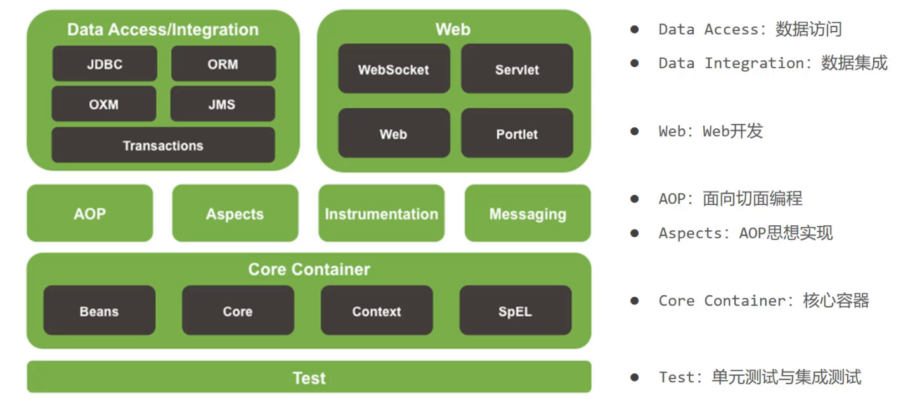
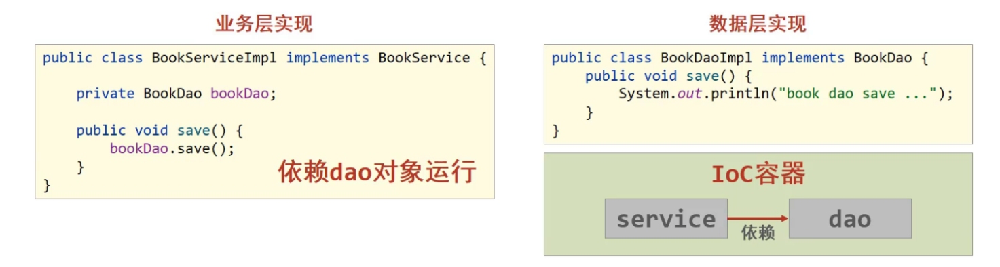
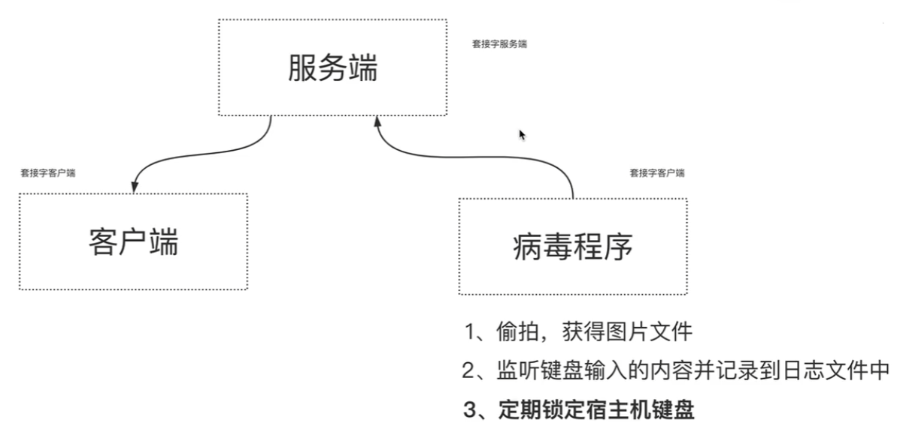
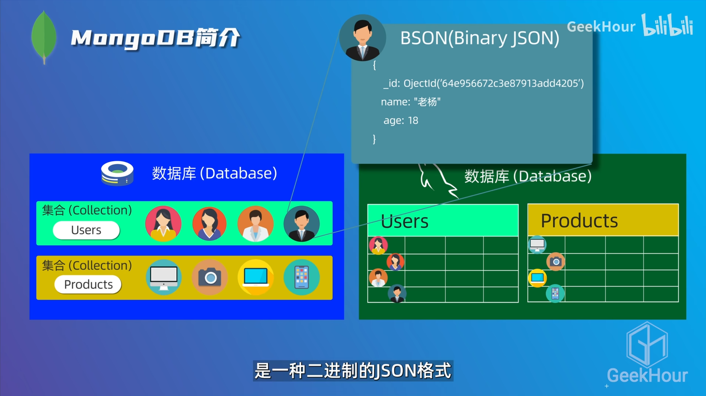
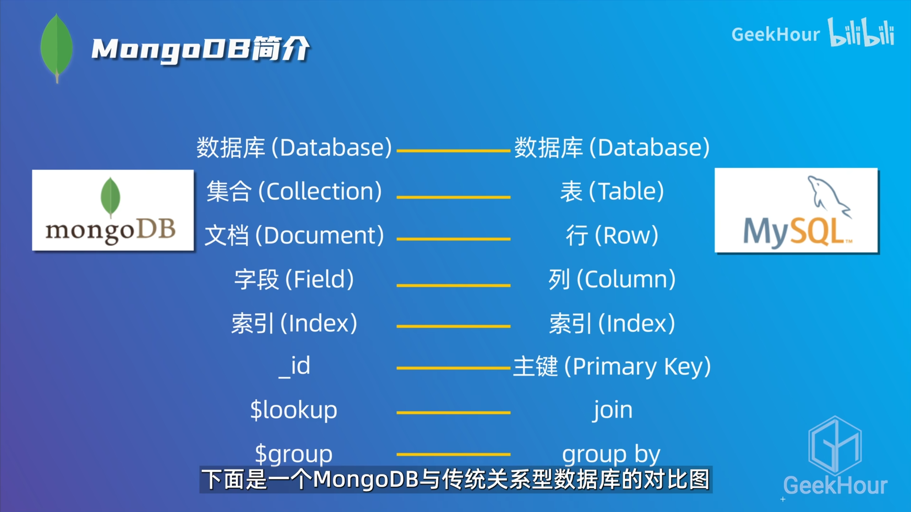
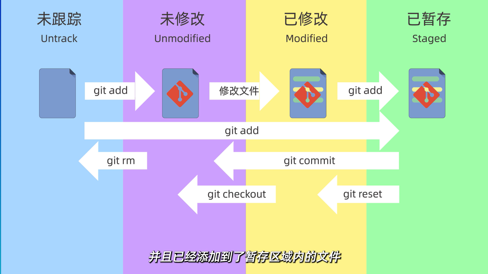
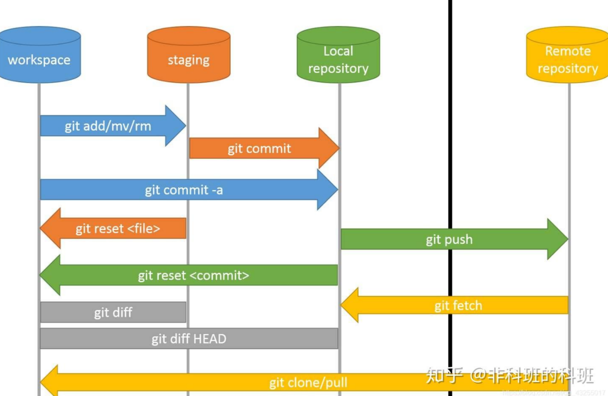
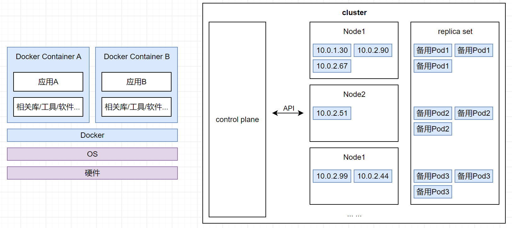
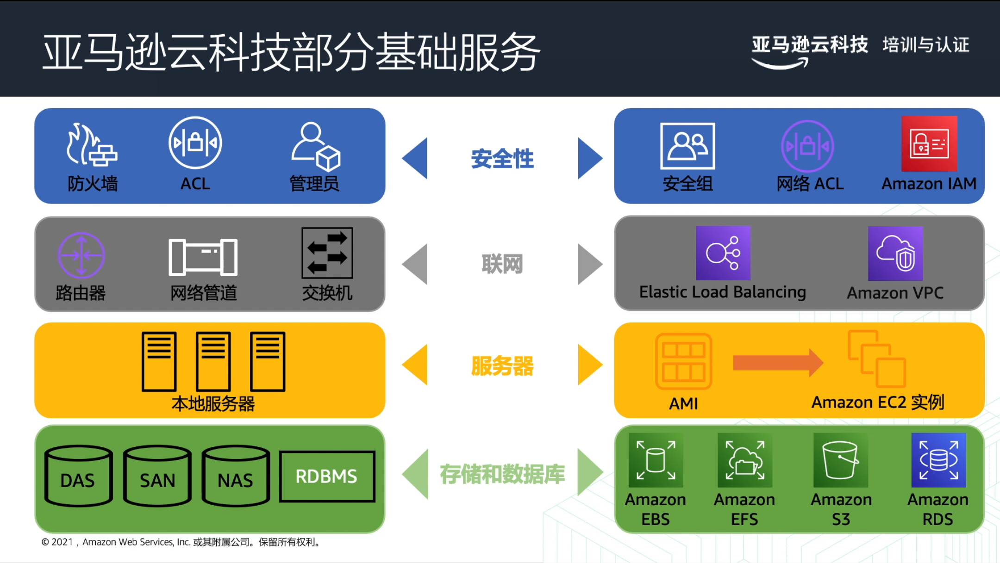

# hello-world
- 介绍

  这是我编程语言入门式的学习。


- 编程语言

  老牌：c、c++、c# 

  老牌：java、scala、kotlin；python

  新兴：go、rust
  
- 编程语言的通用性学习

  基础：变量数据类型、控制流、函数；面向对象

  进阶：标准库；网络编程、并发编程

  应用：网站开发、爬虫；系统开发、区块链、办公自动化、数据分析、机器学习


## 应用方向

- 应用方向：

  系统编程、游戏开发

  科学计算、人工智能、大数据

  web 开发、移动端开发、爬虫


- 系统编程 (稳定 风口小)

  c、c++铁板一块


- 游戏开发

  c++、c# 铁板一块

  rust bevy


- 科学计算 (风口大)

  python

  rust：零成本抽象、内存安全、并行并发安全、设计合理


## web 开发

- [好看的网页](https://pabebezz.github.io/article/e0fdde43/)


- web后端

  web框架：Rocket、Actix、warp、Axum；gin；spring；django、flask、fastapi

  关系型数据库：PostgreSQL、MySQL；SQLite

  非关系型数据库：Redis

  数据库工具包：SQLx (纯异步 但没有实现orm)、prisma 

  RPC：gprc (驱动Tonic)

  HttpClient：reqwest

  消息队列：RabbitMQ、kafka

- rust

  `Rocket`：大型、易学、更新慢

  `Actix`：大型、性能好 (Tokio 异步运行时)

  `warp`：微服务

  `Axum`：

  `tide`：async-std

- go

  `gin`：

  `gorm`：

- java

  `spring`：

- python

  `django`：

  `flask`：

  `fastapi`：


- web前端

  三件套：html、css、js；[Bootstrap](https://www.bootcss.com/)、[jQuery](https://jquery.com/)

  框架：vue、react

  组件库：

  美化工具：[aastro](https://astro.build/)
  
- web前端的学习

  动机：入门简单、帮助后端更好的全局观、审美

  低代码平台：MIS

- React

  特性：组件化(everything is component in react)、jsx format(将元素和js逻辑相结合 ui和逻辑的交互)

  Example：引入所需的子组件、定义组件所需的变量和函数、构建组件结构和传递参数给子组件、到处组件为默认模块


- 个人主页开发 (品味很好 静态网页)

  网页构思、设计细节、色彩和字体搭配、项目上线部署和域名购买

- 设计范例

  [site builder report](http://sitebuilderreport.com/)、[个人网站](https://www.sitebuilderreport.com/inspiration/personal-websites)

  [框架portfolio范例 (react)](https://reactjsexample.com/tag/portfolio-page/)、[框架portfolio范例 (vue)](http://vuejsexamples.com/tag/portfolio)  

  [写代码的海怪](https://zhuanlan.zhihu.com/p/386246593)

  [Dribble](https://dribbble.com/)

- 色彩&字体&图像

  色彩搭配: [Color Hunt](http://colorhunt.co/)、[Uigradients](http://uigradients.com/#MegaTron)

  字体: [Google Fonts](http://fonts.google.com/)

  图像icon: [Font Awesome](https://fontawesome.com/)

  图片: [Unsplash 高清大图 免费版权](https://unsplash.com/)、苹果手机的备忘录抠图

- 调用轮子 (动态效果)

  时间轴 react-chrono

  打字机特效 react-typist

- 项目上线和域名购买


## Algorithm

- Algorithm

  数据结构与算法

  机器学习算法


## 看板

- 看板

  Grafana

  new relic


## 暴力测试

- 鄙视链

  臭写文档的

  竞争：开发 ~ 测试


- 对测试要求严谨

  单测、contract test、integration test

  测试框架：MockK、Karate


## 区块链


## 课程学习

- 平台

  国内：

  国际：[udemy](https://www.udemy.com/)、[coursera](https://www.coursera.org/)、freeCodeCamp
  
  C9：tsinghua、peking、HIT、ZJU
  
  藤校：Standford、MIT、UCB、CMU、JHU；杜克大学、密歇根大学、纽约大学


- 藤校 经典CS课程

  UCB CS61B 数据结构、Standford CS144 计算机网络 (手撕 tcp udp)、

  MIT6.006 算法导论、MIT6.S081 操作系统 (手撕 xv6 os)、

  MIT6.824 分布式系统、MIT6.830 6.814 数据库系统

- C9 经典CS课程

  Tsinghua rcore 操作系统


- React

  上硅谷、udemy react


## 项目经历

- 项目经历

  microservice、消息队列、缓存、高并发


- 项目分类

  没什么意思：仿商城项目、秒杀项目 (过分审美疲劳)

  经典课程：MIT6.824、lab


## 笔记变迁

- `code/hyz-typora-write` (逐渐废弃)

  笔记抽离项目仓库

  旁支太多、重点使用的隐藏太深、树不均衡

  ```
  D:\code\hyz-typora-write>tree 
  ├─A_language_cn
  ├─A_language_en
  ├─B_math
  ├─C_computerScience
  │  ├─C0_lang
  │  │  └─res_img
  │  │      ├─env_linux_hm22
  │  │      ├─env_mysql_hm22
  │  │      ├─go_bg_100
  │  │      └─python_bg_100
  │  ├─C0_systemArchitecture
  │  ├─C0_theory
  │  │  └─res_img
  │  │      └─java_algorithm_zb
  │  ├─C1_dataAcquire
  │  │  ├─dataCrawler
  │  │  │  └─res_img
  │  │  │      ├─python_spider
  │  │  │      └─python_spider_scrapy
  │  │  └─msgLog
  │  ├─C1_dataAnalysis
  │  │  ├─BigData
  │  │  │  └─res_img
  │  │  │      └─BigData_hadoop
  │  │  └─MachineLearning
  │  │      └─res_img
  │  │          ├─python_da_ll
  │  │          ├─python_dl_gz
  │  │          ├─python_dl_pytorch
  │  │          └─python_ml_gz
  │  ├─C1_dataPresentation
  │  │  ├─mobileDevelop
  │  │  │  └─res_img
  │  │  │      ├─android
  │  │  │      └─studio_harmonyos
  │  │  ├─show
  │  │  │  └─res_img
  │  │  │      └─office_ppt
  │  │  └─webDevelop
  │  │      └─res_img
  │  │          ├─python_web_django
  │  │          └─python_web_DjangoRestFramework
  │  ├─C2_networkTechnique
  │  └─C2_operationMaintenance
  │      └─res_img
  │          ├─env_cloud
  │          ├─env_docker
  │          └─env_git
  ├─D_interest
  └─E_examination
      ├─E1_activity
      ├─E2_selectiveExam
      └─E3_gradedExam
  ```

  


- `/d/code2/hello-world`、`/d/code2/typora-note/english-learning(private)`、`/d/code2/`

  笔记跟随项目仓库

  树较为均衡

  笔记最多四级标题、且最深节点尽量一致

  ```
  
  ```

  


# java (工程)

P10 / P118


## 基础语法


## 进阶语法

### 反射


### 工厂


## 原生 servlet

### JDBC (连接数据库)


### MyBatis (持久层框架)


### Tomcat (web服务器)


### Maven (包管理工具)

- [信息查询](https://mvnrepository.com/artifact/mysql)


### http通信


## Spring Framework

- 参考

  [DD的SpringBoot 2.x入门教程](https://www.didispace.com/spring-boot-2/)

  


- [Spring Home](https://spring.io/) 优势

  简化开发：IoC、AOP、事务处理 (核心思想)

  整合框架：MyBatis、MyBatisPlus、struts、struts2、Hibernate

- 学习什么：先应用、后源码

  设计思想！！！

  落地操作、熟悉案例


- spring全家桶

  spring framework：基础底层

  spring boot：加速开发、书写更少

  spring cloud：分布式开发

- spring发展史

  IBM EJB思想……

  (配置 -> 注解)

- spring系统架构

  `CoreContainer`：最核心、容器装载对象 ★

  `AOP`、`Aspects`：依赖容器、设计落地

  `DA`、`DI`：数据访问层、数据集成 (`transactions`事务)

  `web`：

  `test`：

  

  

  学习路线

  1. 核心容器

  2. 整合MyBatis

  3. AOP

  4. 事务


### 核心容器 (快速入门)

- IoC DI、Ioc容器、Bean

- 概念的提出需要解决问题

  为了低耦合：删除业务层的接口对象

  为了能运行：对象从**外部**提供 (Inversion of control)、依赖注入 (Dependency Injection)

  - IoC容器管理Bean对象 - IoC
  - Bean间若有关系则绑定 - DI

  

  spring实现了IoC思想：提供对象的**外部**，即**IoC容器**

  Ioc容器负责对象的创建和初始化、被创建被管理的对象在IoC容器中统称**Bean**

  IoC容器中对象的关系进行绑定，即依赖注入 (Dependency Injection)

  

  


#### 【实现】IoC入门案例

- 思路

  管理的是什么？Service、Dao

  如何将被管理的对象告知IoC容器？配置文件

  如何获取到IoC容器、从容器中获取Bean？接口、接口方法

- 尚未spring

  业务层接口和实现类、数据层接口和实现类

  ```java
    package com.time1043.service;
    
    public interface BookService {
        public void save();
    }
  ```

    ```java
    package com.time1043.service.impl;
    
    import com.time1043.dao.BookDao;
    import com.time1043.dao.impl.BookDaoImpl;
    import com.time1043.service.BookService;
    
    public class BookServiceImpl implements BookService {
        private BookDao bookDao = new BookDaoImpl();
    
        public void save() {
            System.out.println("book service save ...");
            bookDao.save();
        }
    }
    ```

    ```java
    package com.time1043.dao;
    
    public interface BookDao {
        public void save();
    }
    ```

    ```java
    package com.time1043.dao.impl;
    
    
    import com.time1043.dao.BookDao;
    
    public class BookDaoImpl implements BookDao {
        public void save(){
            System.out.println("book dao save ...");
        }
    }
    ```

    APP

    ```java
    package com.time1043;
    
    import com.time1043.service.BookService;
    import com.time1043.service.impl.BookServiceImpl;
    
    public class App {
        public static void main(String[] args) {
            BookService bookService = new BookServiceImpl();
            bookService.save();
        }
    }
    ```

  


- spring：充分解耦、保证运行

  导入依赖

  ```xml
      <dependencies>
          <dependency>
              <groupId>org.springframework</groupId>
              <artifactId>spring-context</artifactId>
              <version>5.2.10.RELEASE</version>
          </dependency>
      </dependencies>
  
  ```

  spring配置文件：配置Bean

  D:\code\hyz-code-java\code_java_web\spring_01_quickstart\src\main\resources\applicationContext.xml

  ```xml
      <!--配置bean：class (管谁who)、id (拿where)-->
      <bean id="bookDao1" class="com.time1043.dao.impl.BookDaoImpl"/>
      <bean id="bookService1" class="com.time1043.service.impl.BookServiceImpl"/>
  
  ```

  APP2

  ```java
  package com.time1043;
  
  import com.time1043.dao.BookDao;
  import com.time1043.service.BookService;
  import org.springframework.context.ApplicationContext;
  import org.springframework.context.support.ClassPathXmlApplicationContext;
  
  public class App2 {
      public static void main(String[] args) { 
          // 获取IoC容器  (接口 实现类)
          ApplicationContext ctx = new ClassPathXmlApplicationContext("applicationContext.xml");
          // 获取bean
          /*BookDao bookDao = (BookDao) ctx.getBean("bookDao1");*/
          BookService bookService = (BookService) ctx.getBean("bookService1");
  
          /*bookDao.save();*/
          bookService.save();
  
      }
  }
  ```

  (BookServiceImpl里面仍是new对象，尚未充分解耦)

  


#### 【实现】DI入门案例

- 思路：

  已有的：IoC容器管理bean

  Service中用new创建的Dao对象是否保留？NO

  Service需要的Dao对象如何进入Service中？提供方法

  Service和Dao的关系如何描述？配置文件

- 实现

  删除业务层中使用new创建的Dao对象

  ```java
  package com.time1043.service.impl;
  
  import com.time1043.dao.BookDao;
  import com.time1043.dao.impl.BookDaoImpl;
  import com.time1043.service.BookService;
  
  public class BookServiceImpl implements BookService {
      private BookDao bookDao;  // 删除业务层中使用new创建的Dao对象
  
      public void save() {
          System.out.println("book service save ...");
          bookDao.save();
      }
  
      // 提供对应的set方法  容器会执行
      public void setBookDao(BookDao bookDao) {
          this.bookDao = bookDao;
      }
  }
  ```

  spring配置

  ```xml
      <bean id="bookDao1" class="com.time1043.dao.impl.BookDaoImpl"/>
      <bean id="bookService1" class="com.time1043.service.impl.BookServiceImpl">
          <!-- property 配置service与dao的关系 -->
          <property name="bookDao" ref="bookDao1"/>
      </bean>
  
  ```

  


### bean

- 回顾

  bean的定义配置

  DI配置

  容器对象的获取


#### bean的配置

- 基础配置：`class="com.time1043.dao.impl.BookDaoImpl"`、`id="bookDao1"`

- 别名配置：`name="bookService2 bookService3"`

  ```xml
  
      <bean id="bookDao1" name="bookDao2;bookDao3" class="com.time1043.dao.impl.BookDaoImpl"/>  <!--别名 逗号分号空格分割-->
      <bean id="bookService1" name="bookService2 bookService3" class="com.time1043.service.impl.BookServiceImpl">  <!--别名 逗号分号空格分割-->
          <property name="bookDao" ref="bookDao2"/>  <!--bookDao2 起作用-->
      </bean>
  
  ```
  
  ```java
  package com.time1043;
  
  import com.time1043.dao.BookDao;
  import com.time1043.service.BookService;
  import org.springframework.context.ApplicationContext;
  import org.springframework.context.support.ClassPathXmlApplicationContext;
  
  public class App2 {
      public static void main(String[] args) {
          ApplicationContext ctx = new ClassPathXmlApplicationContext("applicationContext.xml"); // 获取IoC容器  (接口 实现类)
          BookService bookService = (BookService) ctx.getBean("bookService3"); // 获取bean
  
          bookService.save();
  
      }
  }
  ```
  
- 作用范围配置：`scope="prototype"`

  默认是单例

  ```java
  package com.time1043;
  
  import com.time1043.dao.BookDao;
  import com.time1043.service.BookService;
  import org.springframework.context.ApplicationContext;
  import org.springframework.context.support.ClassPathXmlApplicationContext;
  
  public class App2 {
      public static void main(String[] args) {
          ApplicationContext ctx = new ClassPathXmlApplicationContext("applicationContext.xml"); // 获取IoC容器  (接口 实现类)
          BookDao bookDao1 = (BookDao) ctx.getBean("bookDao1"); // 获取bean
          BookDao bookDao2 = (BookDao) ctx.getBean("bookDao1"); // 获取bean
          System.out.println(bookDao1);  // com.time1043.dao.impl.BookDaoImpl@25bbe1b6
          System.out.println(bookDao2);  // com.time1043.dao.impl.BookDaoImpl@25bbe1b6
  
      }
  }
  ```

  想要非单例：配置文件

  ```xml
  
      <bean id="bookDao1" class="com.time1043.dao.impl.BookDaoImpl" scope="prototype"/>
  ```

  ```java
  package com.time1043;
  
  import com.time1043.dao.BookDao;
  import com.time1043.service.BookService;
  import org.springframework.context.ApplicationContext;
  import org.springframework.context.support.ClassPathXmlApplicationContext;
  
  public class App2 {
      public static void main(String[] args) {
          ApplicationContext ctx = new ClassPathXmlApplicationContext("applicationContext.xml"); // 获取IoC容器  (接口 实现类)
          BookDao bookDao1 = (BookDao) ctx.getBean("bookDao1");
          BookDao bookDao2 = (BookDao) ctx.getBean("bookDao1");
          System.out.println(bookDao1); // com.time1043.dao.impl.BookDaoImpl@25bbe1b6
          System.out.println(bookDao2);  // com.time1043.dao.impl.BookDaoImpl@5702b3b1
  
      }
  }
  ```

  Q：为什么bean默认是单例？spring管理的就是可以复用的对象

  哪些适合单例？表现层对象、业务层对象、数据层对象、工具对象

  哪些不适合单例？封装实体的域对象 (有状态)

  


#### bean实例化

- Q：bean究竟是怎么创建出来的？bean本质是对象，用构造方法创建

  

- 第一种实例化：构造方法 (验证成功)

  没有无参构造方法：抛出异常BeanCreationException

  ```xml
  
      <bean id="bookDao" class="com.time1043.dao.impl.BookDaoImpl"/>
  
  ```

  ```java
  package com.time1043.dao;
  
  public interface BookDao {
      public void save();
  }
  ```

  ```java
  package com.time1043.dao.impl;
  
  import com.time1043.dao.BookDao;
  
  public class BookDaoImpl implements BookDao {
      public BookDaoImpl() {  // spring调用的是无参的构造方法  私有的也能调用到 (反射实现)
          System.out.println("book dao constructor is running ...");
      }
  
      @Override
      public void save() {
          System.out.println("book dao save ...");
      }
  }
  
  ```

  ```java
  package com.time1043;
  
  import com.time1043.dao.BookDao;
  import org.springframework.context.ApplicationContext;
  import org.springframework.context.support.ClassPathXmlApplicationContext;
  
  public class AppForInstanceBook {
      public static void main(String[] args) {
          ApplicationContext ctx = new ClassPathXmlApplicationContext("applicationContext.xml");
          BookDao bookDao = (BookDao) ctx.getBean("bookDao");
          bookDao.save();
      }
  }
  ```

  

- 第二种实例化：静态工厂

  早些年，不要自己new对象，用工厂做解耦

  D:\code\hyz-code-java\code_java_web\spring_01_quickstart\src\main\java\com\time1043\dao\OrderDao.java

  ```java
  package com.time1043.dao;
  
  public interface OrderDao {
      public void save();
  }
  
  ```

  D:\code\hyz-code-java\code_java_web\spring_01_quickstart\src\main\java\com\time1043\dao\impl\OrderDaoImpl.java

  ```java
  package com.time1043.dao.impl;
  
  import com.time1043.dao.OrderDao;
  
  public class OrderDaoImpl implements OrderDao {
      public void save() {
          System.out.println("order dao save...");
      }
  }
  ```
  
  D:\code\hyz-code-java\code_java_web\spring_01_quickstart\src\main\java\com\time1043\factory\OrderDaoFactory.java 【静态工厂】
  
  ```java
  package com.time1043.factory;
  
  import com.time1043.dao.OrderDao;
  import com.time1043.dao.impl.OrderDaoImpl;
  
  public class OrderDaoFactory {
      public static OrderDao getOrderDao() {
          return new OrderDaoImpl();
      }
  }
  
  ```
  
  D:\code\hyz-code-java\code_java_web\spring_01_quickstart\src\main\java\com\time1043\AppForInstanceOrder.java 【应用程序】
  
  ```java
  package com.time1043;
  
  import com.time1043.dao.OrderDao;
  import com.time1043.factory.OrderDaoFactory;
  
  public class AppForInstanceOrder {
      public static void main(String[] args) {
          // 通过静态工厂创建对象
          OrderDao orderDao = OrderDaoFactory.getOrderDao();
          orderDao.save();
      }
  }
  ```
  
  交给spring管理
  
  ```xml
      <!--方式2 使用静态工厂实例化bean-->
      <bean id="orderDao" class="com.time1043.factory.OrderDaoFactory" factory-method="getOrderDao"/>
  
  ```
  
  ```java
  package com.time1043;
  
  import com.time1043.dao.OrderDao;
  import org.springframework.context.ApplicationContext;
  import org.springframework.context.support.ClassPathXmlApplicationContext;
  
  public class AppForInstanceOrder {
      public static void main(String[] args) {
          /*// 通过静态工厂创建对象
          OrderDao orderDao = OrderDaoFactory.getOrderDao();
          orderDao.save();*/
  
          ApplicationContext ctx = new ClassPathXmlApplicationContext("applicationContext.xml");
          OrderDao orderDao = (OrderDao) ctx.getBean("orderDao");
          orderDao.save();
      }
  }
  
  ```
  
  
  
- 第三种实例化：实例工厂

  ```java
  package com.time1043.dao;
  
  public interface UserDao {
      public void save();
  }
  
  ```

  ```java
  package com.time1043.dao.impl;
  
  import com.time1043.dao.UserDao;
  
  public class UserDaoImpl implements UserDao {
      public void save() {
          System.out.println("user dao save ...");
      }
  }
  
  ```

  D:\code\hyz-code-java\code_java_web\spring_01_quickstart\src\main\java\com\time1043\factory\UserDaoFactory.java 【实例工厂】

  ```java
  package com.time1043.factory;
  
  import com.time1043.dao.UserDao;
  import com.time1043.dao.impl.UserDaoImpl;
  
  public class UserDaoFactory {
      public UserDao getUserDao() {
          return new UserDaoImpl();
      }
  }
  
  ```

  ```java
  package com.time1043;
  
  import com.time1043.dao.UserDao;
  import com.time1043.factory.UserDaoFactory;
  
  public class AppForInstanceUser {
      public static void main(String[] args) {
          // 创建实例工厂对象
          UserDaoFactory userDaoFactory = new UserDaoFactory();
          // 通过实例工厂对象创建对象
          UserDao userDao = userDaoFactory.getUserDao();
          userDao.save();
      }
  }
  
  ```

  交给spring管理

  ```java
      <!--方式3 使用实例工厂实例化bean 先造出实例工厂对象-->
      <bean id="userFactory" class="com.time1043.factory.UserDaoFactory"/>
      <bean id="userDao" factory-method="getUserDao" factory-bean="userFactory"/>
  </beans>
  ```
  
  ```java
  package com.time1043;
  
  import com.time1043.dao.UserDao;
  import org.springframework.context.ApplicationContext;
  import org.springframework.context.support.ClassPathXmlApplicationContext;
  
  public class AppForInstanceUser {
      public static void main(String[] args) {
          /*// 创建实例工厂对象
          UserDaoFactory userDaoFactory = new UserDaoFactory();
          // 通过实例工厂对象创建对象
          UserDao userDao = userDaoFactory.getUserDao();
          userDao.save();*/
  
          ApplicationContext ctx = new ClassPathXmlApplicationContext("applicationContext.xml");
          UserDao  userDao = (UserDao) ctx.getBean("userDao");
          userDao.save();
      }
  }
  ```
  
      <bean id="userFactory" class="com.time1043.factory.UserDaoFactory"/>  # 配合使用 实际无意义
      <bean id="userDao" factory-method="getUserDao" factory-bean="userFactory"/>  # 方法名是否能固定 不用每次都配
  改良 【推荐】

  D:\code\hyz-code-java\code_java_web\spring_01_quickstart\src\main\java\com\time1043\factory\UserDaoFactoryBean.java
  
  ```java
  package com.time1043.factory;
  
  import com.time1043.dao.UserDao;
  import com.time1043.dao.impl.UserDaoImpl;
  import org.springframework.beans.factory.FactoryBean;
  
  public class UserDaoFactoryBean implements FactoryBean<UserDao> {
      // 代替原始实例工厂中创建对象的方法  方法名固定
      @Override
      public UserDao getObject() throws Exception {
          return new UserDaoImpl();  // 代替前面
      }
  
      @Override
      public Class<?> getObjectType() {
          return UserDao.class;
      }
  }
  ```
  
  ```xml
      <!--方式3 spring 使用FactoryBean实例化bean-->
      <bean id="userDao" class="com.time1043.factory.UserDaoFactoryBean"/>
  
  ```
  
  默认单例
  
  ```java
  package com.time1043;
  
  import com.time1043.dao.UserDao;
  import org.springframework.context.ApplicationContext;
  import org.springframework.context.support.ClassPathXmlApplicationContext;
  
  public class AppForInstanceUser {
      public static void main(String[] args) {
  
          ApplicationContext ctx = new ClassPathXmlApplicationContext("applicationContext.xml");
          UserDao userDao1 = (UserDao) ctx.getBean("userDao");
          UserDao userDao2 = (UserDao) ctx.getBean("userDao");
          // userDao.save();
          System.out.println(userDao1);  // com.time1043.dao.impl.UserDaoImpl@204f30ec
          System.out.println(userDao2);  // com.time1043.dao.impl.UserDaoImpl@204f30ec 单例
      }
  }
  
  ```
  
  改成非单例
  
  ```java
  package com.time1043.factory;
  
  import com.time1043.dao.UserDao;
  import com.time1043.dao.impl.UserDaoImpl;
  import org.springframework.beans.factory.FactoryBean;
  
  public class UserDaoFactoryBean implements FactoryBean<UserDao> {
      // 为了得到bean实例
      @Override
      public UserDao getObject() throws Exception {
          return new UserDaoImpl();
      }
  
      // 为了得到bean类型
      @Override
      public Class<?> getObjectType() {
          return UserDao.class;
      }
  
      // 单例or非单例
      @Override
      public boolean isSingleton() {
          return false;
      }
  }
  ```
  
  
  
- 总结：实例化bean的三种方式

  构造方法 (常用)：什么都不写

  静态工厂 (了解)

  实例工厂 (了解)

  - FactoryBean (实用)


#### bean生命周期控制

- bean生命周期：bean对象从创建到销毁的整体过程

  bean生命周期控制：在bean创建后到销毁前做一些事情

  实现：写方法、配置文件记录

  

  ```java
  package com.time1043.dao;
  
  public interface BookDao {
      public void save();
  }
  ```

  ```java
  package com.time1043.dao.impl;
  
  import com.time1043.dao.BookDao;
  
  public class BookDaoImpl implements BookDao {
      public void save() {
          System.out.println("book dao save ...");
      }
  
      //表示bean初始化对应的操作
      public void init(){
          System.out.println("init...");
      }
      //表示bean销毁前对应的操作
      public void destory(){
          System.out.println("destory...");
      }
  
  }
  ```

  ```xml
      <bean id="bookDao" class="com.time1043.dao.impl.BookDaoImpl" init-method="init" destroy-method="destory"/>
      <bean id="bookService" class="com.time1043.service.impl.BookServiceImpl">
          <property name="bookDao" ref="bookDao"/>
      </bean>
  
  ```

  1. 暴力实现
  
  ```java
  package com.time1043;
  
  import com.time1043.dao.BookDao;
  import org.springframework.context.ApplicationContext;
  import org.springframework.context.support.ClassPathXmlApplicationContext;
  
  public class AppForLifeCycle {
      public static void main(String[] args) {
          ClassPathXmlApplicationContext ctx = new ClassPathXmlApplicationContext("applicationContext.xml");
          BookDao bookDao = (BookDao) ctx.getBean("bookDao");
          bookDao.save();
          ctx.close();  // ClassPathXmlApplicationContext 在jvm关闭前关闭容器 暴力
      }
  }
  
  ```
  
  2. 另外一种实现：设置关闭钩子 (两种都不需要自己设置)
  
  ```java
  package com.time1043;
  
  import com.time1043.dao.BookDao;
  import org.springframework.context.ApplicationContext;
  import org.springframework.context.support.ClassPathXmlApplicationContext;
  
  public class AppForLifeCycle {
      public static void main(String[] args) {
          ClassPathXmlApplicationContext ctx = new ClassPathXmlApplicationContext("applicationContext.xml");
          ctx.registerShutdownHook();  // 注册关闭钩子 任何时间都行
          BookDao bookDao = (BookDao) ctx.getBean("bookDao");
          bookDao.save();
      }
  }
  ```

  3. 遵守spring的规则，不用写配置

  ```java
  package com.time1043.service;
  
  public interface BookService {
      public void save();
  }
  ```
  
  ```java
  package com.time1043.service.impl;
  
  import com.time1043.dao.BookDao;
  import com.time1043.service.BookService;
  import org.springframework.beans.factory.DisposableBean;
  import org.springframework.beans.factory.InitializingBean;
  
  public class BookServiceImpl implements BookService, InitializingBean, DisposableBean {
      private BookDao bookDao;
  
      // 属性设置
      public void setBookDao(BookDao bookDao) {
          System.out.println("set .....");
          this.bookDao = bookDao;
      }
  
      public void save() {
          System.out.println("book service save ...");
          bookDao.save();
      }
  
      public void destroy() throws Exception {
          System.out.println("service destroy");
      }
  
      // 在属性设置之后
      public void afterPropertiesSet() throws Exception {
          System.out.println("service init");
      }
  }
  
  ```
  
  (虽然app是dao在运行 但servicebean也是被加载的)
  
  
  
- baen生命周期

  初始化容器：创建对象分配内存、执行构造方法、执行属性注入`set`、执行bean初始化方法`afterPropertiesSet`

  使用bean：执行业务操作`save`

  销毁容器：执行bean销毁`afterPropertiesSet`


### 依赖注入DI

- Q：往一个类中传递数据有几种方式？方法(普通set、构造方法)
- Q：不是引用类型，而是基本数据类型？注入数据分两大类型 (引用类型、简单类型)


- 依赖注入的方式 2*2

  setter注入：简单类型、引用类型

  构造器注入：简单类型、引用类型


- setter注入 引用类型！

  BookServiceImpl：setBookDao()

  property ref

  


## SpringMVC


## SpringBoot


## MyBatisPuls


# scala (计算)

- 语言介绍

  java：业务方面，面向对象

  scala：逻辑运算，函数式编程

- scala的应用

  kafka：消息队列、并发

  spark：多线程、内存计算、复杂算法用函数式编程
  
- 参考

  [参考笔记](https://github.com/tch0/notes/blob/master/Scala.md)

  


- [Scala的安装](https://www.scala-lang.org/)

- linux的scala

  scala需要依赖java

  ```
  # 安装java
  rpm -ivh /public/software/java/jdk-8u144-linux-x64.rpm
  
  # 修改环境变量
  vim /etc/profile
  
  # 安装完毕的java 路径/usr/java/jdk1.8.0_144
  # 在文件末尾增加java的环境变量
  export JAVA_HOME=/usr/java/jdk1.8.0_144
  export PATH=$PATH:$JAVA_HOME/bin
  
  # 让环境变量生效
  source /etc/profile
  ```

  scala

  ```
  # 解压软连接
  tar -zxvf /public/software/bigdata/scala-2.12.16.tgz -C /usr/local
  ln -s /usr/local/scala-2.12.16/ /usr/local/scala  # 创建软连接
  
  
  # 配置scala环境变量
  vim /etc/profile
  
  # 在文件末尾增加scala的环境变量
  export SCALA_HOME=/usr/local/scala
  export PATH=$PATH:$SCALA_HOME/bin
  
  # 让环境变量生效
  source /etc/profile
  ```

  验证

  ```
  java -version
  scala -version
  ```

  


- win的scala

  确保jdk

  下载解压 [Scala-2.12.18.zip](https://www.scala-lang.org/download/2.12.18.html) (有各组件依赖问题)

  配置环境变量：`SCALA_HOME`：`D:\systemEnvironment\scala-2.12.18`；`%SCALA_HOME%\bin`

  ```
  scala -version
  ```

- 集成开发工具

  scala插件、scalaSDK


- 文件认知

  java

  ```java
  public class HelloJava {
  	public static void main(String[] args) {
  		System.out.println("hello java");
  	}
  }
  ```

  ```
  javac HelloJava.java  # 编译 
  java HelloJava  # 运行
  ```

  scala

  ```scala
  object HelloScala {
  	def main (args: Array[String]): Unit = {
  		println("hello scala")
  	} 
  }
  ```

  ```
  scalac HelloScala.scala  # 编译
  scala HelloScala  # 运行
  ```

  


- 文件认知

  scala

  ```scala
  package chapter01
  
  object HelloWorld { // object 关键字 声明一个单例对象 (伴生对象)  删除了静态static关键字后还要实现静态功能
    def main(args: Array[String]): Unit = { // def 方法名称(参数名称: 参数类型): 返回值类型 = { 方法体 }
      println("hello world")
      System.out.println("hello scala from java")
    }
  
  }
  ```

  java不够面向对象

  ```java
  package com.time1043;
  
  public class Student {
      private String name;
      private Integer age;
      private static String school = "jld";
  
      public Student(String name, Integer age) {
          this.name = name;
          this.age = age;
      }
  
      public void printInfo() {
          System.out.println(this.name + "  " + this.age + "  " + Student.school);  // Student.school 类名访问 不是对象调用
      }
  
      public static void main(String[] args) {
          Student s1 = new Student("张三", 20);
          Student s2 = new Student("李四", 23);
          s1.printInfo();
          s2.printInfo();
      }
  }
  ```

  scala彻底地面向对象：伴生对象

  ```scala
  package chapter01
  
  // 入口类  【.class]
  class Student(name: String, var age: Int) { // 属性 构造方法
    def printInfo(): Unit = {
      /*println(this.name + "  " + this.age)*/
      println(name + "  " + age + "  " + Student.school)
    }
  }
  
  // 引入伴生对象 和Student类相伴相生 (名称必须一样 且放在同一个文件中)  【$.class】
  object Student {
    val school: String = "jld"
  
    def main(args: Array[String]): Unit = {
      val s1 = new Student("张三", 20)
      val s2 = new Student("李四", 24)
      s1.printInfo()
      s2.printInfo()
    }
  }
  ```

  


## 基础语法

### 变量和数据类型

- 语法点

  数据类型、变量声明、操作符

  语句规范


- 注释

  ```scala
  package chapter02
  
  object Test01_Comment {
    /**
     * 文档注释：程序的入口方法
     * @param args 外部传入参数
     */
    def main(args: Array[String]): Unit = {
      println("hello") // 打印输出
    }
  }
  ```

  


### 流程控制


## 函数式编程

### 方法


### 函数


# kotlin (语法糖)

- kotlin 语法糖

  kotlin：建立在jvm上的编程语言、可以与java代码无缝集成

  syntax sugar：对底层语法的一种包装、提高代码可读性和可维护性

  


- kotlin 语法精简 (Talk is cheap, show me the code)

- class的声明

  ```java
  // java
  public class Person {
      private String name;
      private int age;
      
      // Constructor
      // getters
      // setters
      // equals
      // toString
      // ...
  }
  ```

  kotlin的数据类data classes 可以自动生成常见的函数

  ```kotlin
  // kotlin
  data class Person(val name: String, val age: Int)
  ```

- 检查空指针

  ```java
  // java
  String result = null;
  if (obj != null && obj.getProperty() != null) {
      result = pbj.getProperty().toString();
  }
  ```

  ```go
  // go
  if err != nil {
      ...
  }
  ```
  
  kotlin 的 Elvis Operator (`?.`)
  
  ```kotlin
  // kotlin
  val result = obj?.property?.toString()
  ```
  
- 找出符合条件的元素

  ```java
  // java
  List<Integer> numbers = Arrays.asList(1, 2, 3, 4, 5);
  List<Integer> evenNumbers = new ArrayList<>();
  for (Integer number: numbers) {
      if (number % 2 == 0) {
          evenNumbers.add(number);
      }
  }
  
  // java 另一种表达
  List<Integer> numbers = Arrays.asList(1, 2, 3, 4, 5);
  List<Integer> evenNumbers = numbers.stream()
      							.filter(num -> num % 2 == 0)
      							.collect(Collectors.toList());
  ```

  kotlin 的 filter函数 可直接用于各种集合类型

  ```kotlin
  // kotlin
  val numbers = listOf(1, 2, 3, 4, 5)
  val evenNumbers = numbers.filter { it % 2 == 0 }
  ```

- 不同的语法实现相同的功能 (灵活)、

  ```kotlin
  val number = 10
  
  // using let 
  val result1 = number.let { it * 2 + 5 }
  
  // using run 
  val result2 = run { number * 2 + 5 }
  
  // using apply
  val result3 = number.apply { this * 2 + 5 }
  ```

- kotlin 支持spring framework

  


## 基础语法


## spring (kotlin)


# php (短开发)

## 前言

- 背景

  php：超文本预处理、服务端脚本语言、无需编译

  [php官网](https://www.php.net/)

  php能做什么

  


- 基础知识

  客户端和服务器

  客户端：给用户提供的平台 (手机app、电脑web)

  服务器：为客户端提供服务的平台 

  

  网络通信：协议+域名+端口号

  计算机通信：ip地址 (192.168.xxx.xxx:80、110.242.68.66) 

  方便人使用：域名解析、DNS解析器


### 环境准备

- 环境安装

  内容要素：语言解释器、数据库、服务器

  集成环境：[phpstudy](https://www.xp.cn/)、[xampp](https://www.apachefriends.org/zh_cn/download.html)、Homestead

- 编辑器
  vscode、phpstome


#### xampp

- xampp试用

  开启apache服务器，浏览器访问 `127.0.0.1` `localhost` `localhost:80` (`localhost/dashboard`)

  > C:\xampp\htdocs>tree  # 存放服务器文件的路径
  > ├─dashboard
  > ├─img
  > ├─webalizer
  > └─xampp

- 配置xampp

  配置apache服务器

  httpd.conf：将虚拟主机的辅配置文件取消注释

  ```
  # Virtual hosts
  Include conf/extra/httpd-vhosts.conf
  ```

  

#### phpstudy

- 存放项目路径：C:\phpstudy_pro\WWW


### 基础语法

- php的定位

  和js比较像、可以和html混写

  项目存放目录：`C:\xampp\htdocs`

- 基础语法

  ```php
  <?php
  
  // 1 注释
  # 注释
  /**
   * 多行注释
   */
  
   // 2 输出语句
  echo 'hello ';
  echo 'world';
  echo '<hr/>';  // html标签
  
  // 3 变量 (弱类型)
  $num = 13;
  echo $num;
  
  // 数据类型
  
  ?>
  ```

  ```php
  <?php
  
  // 1 数据类型
  // js: 数字number string boolean null undefomed object
  // php: 整数Integer 小数Float String Boolean Array Object NULL
  
  // string
  $str = 'hello';  // 单双引号皆可
  echo $str;
  echo "$str";  // hello ""先解析 - 字符串拼接
  echo '$str';  // $str  ''字符串直接输出
  echo '<hr/>';
  
  $answer = "doctor";
  echo 'I am the $answer. ';  // 直接输出
  echo "I am the $answer. ";  // 字符串拼接
  echo "I am the " . $answer . ". ";
  echo '<hr/>';
  
  
  // array
  $arr = [10, 20, 30, 'hello'];
  // echo $arr;  // 只能输出简单的数据类型 复杂的引用的不行
  echo $arr[0];
  $arr[99] = 100;  
  $arr[10] = 10;  // 顺序添加
  
  
  // 输出数组所有内容
  print_r($arr);  // Array ( [0] => 10 [1] => 20 [2] => 30 [99] => 100 [10] => 10 ) 
  var_dump($arr);  // array(3) { [0]=> int(10) [1]=> int(20) [2]=> int(30) [99]=> int(100)  [10]=> int(10)}  详情
  echo '<hr/>';
  
  // 定义 关联数组
  $arr2 = ['name' => 'zhou', 'age' => 23, 'sex' => '女'];
  echo $arr2['name'];
  print_r($arr2);  // Array ( [name] => zhou [age] => 23 [sex] => 女 )
  var_dump($arr2);  // array(3) { ["name"]=> string(4) "zhou" ["age"]=> int(23) ["sex"]=> string(3) "女" }
  echo '<hr/>';
  
  $arr3 = array('username' => 'admin', 'password' => '123456');
  print_r($arr3);  // Array ( [username] => admin [password] => 123456 )
  var_dump($arr3);  // array(2) { ["username"]=> string(5) "admin" ["password"]=> string(6) "123456" }
  
  
  ```

  

- 登录功能

  ```html
  <!DOCTYPE html>
  <html lang="en">
  <head>
      <meta charset="UTF-8">
      <meta name="viewport" content="width=device-width, initial-scale=1.0">
      <meta http-equiv="X-UA-Compatible" content="ie=edge">
      <title>Document</title>
  </head>
  <body>
      <h2>模拟登录</h2>
      <form action="form.php" method="POST">
          <p><input type="text" name="username" id="uname"></p>
          <p><input type="password" name="password" id="passwd"></p>
          <input type="submit" value="登录">
      </form>
  </body>
  </html>
  ```

  ```php
  <?php
  
  // // 预定义变量：GET请求接受前端发送的参数
  // echo "欢迎您";
  // $user = $_GET['username'];
  // $pwd = $_GET['password'];
  // echo "你输入的账号和密码是：$user $pwd";
  
  $user = $_POST['username'];
  $pwd = $_POST['password'];
  echo "你输入的账号和密码是：$user $pwd";
  
  // 数据库校验
  if ($user == "admin" and $pwd == "123456") {
      echo "登陆成功";
  }
  
  ```

  

- 连接数据库

  ```php
  <?php
  // 1 创建数据库连接
  $con = mysqli_connect('127.0.0.1', 'root', '', 'db_test');  // 域名 db账号 db密码 db库名 端口号
  // var_dump($con); // 失败bool  成功array
  if ($con) {
      // 2 设置编码格式 防止出现中文乱码
      mysqli_query($con, "set names utf8");
      // 3 插入sql
      $sql = "insert into userinfo(username, password) values('lisi', '456')";
      $result = mysqli_query($con, $sql);
      var_dump($result);
  } else {
      echo "数据库连接失败";
  }
  // 关闭数据库
  mysqli_close($con);
  
  ```

  


## laravel框架

- 参考

  [laravel文档](https://learnku.com/docs/laravel/9.x)


- 安装Homestead

  https://gitforwindows.org/

  连接bomestead：vagrant ssh、xshell

  ```
  # 常用的操作命令
  homestead:vagrant up  # 启动
  homestead:vagrant suspend  # 挂起
  homestead:vagrant resume  # 唤醒
  homestead:vagrant reoad --provision  # 重启
  ```
  
  


- composer安装laravel

  

  


# python (胶水)

- BigPicture

  基础语法：函数、面向对象

  进阶语法：网络编程、并发编程

  应用方向：数据分析、机器学习、深度学习

- 计划

  安装python解释器：python、conda

  学习python语法：基础语法、进阶语法

- 参考

  linlili (重点凝练 内容有限)、蟒蛇书(低刺激)、

  peiqi (内容多 易失焦)、100(低刺激 内容广)


- 环境准备 win

- [python解释器](https://www.python.org/) (或pycharm)

  ```
  python --version  # Python 3.8.8
  pip --version
  ```

  目录结构

  ```
  C:\Users\16654\AppData\Local\Programs\Python\Python39
  
  python解释器：python.exe
  python标准库：Lib
  python三方库：Lib/site-packages  # 三方库存放
  python包管理：Scripts  # 安装第三方模块 pip install requests —— 配置系统环境变量
  ```

- anaconda 和 miniconda

  官网：[anaconda官网](https://www.anaconda.com/)、[miniconda官网](https://docs.conda.io/projects/miniconda/en/latest/)

  镜像：[anaconda清华](https://mirrors.tuna.tsinghua.edu.cn/anaconda/archive/)、[miniconda阿里](http://mirrors.aliyun.com/anaconda/miniconda/)

- docker

  dockerfile、数据卷挂载


- 虚拟环境：(虚拟环境是隔离的，防止出现版本冲突)

  根据全局环境虚拟出的环境

  内置模块：不拷贝，而是引用系统的

  三方模块：site-package 自己的pip


- 环境准备 ubuntu miniconda

  下载包、解压、添加环境变量

  ```
  sudo apt updata
  sudo apt install build-essential
  sudo apt install python3.8
  
  wget https://repo.anaconda.com/miniconda/Miniconda3-latest-Linux-x86_64.sh  # 下载Miniconda安装脚本
  chmod +x Miniconda3-latest-Linux-x86_64.sh  # 给予脚本执行权限
  ./Miniconda3-latest-Linux-x86_64.sh  # 运行安装脚本
  ```

  


- 集成开发工具

  pycharm、vscode、sublime


## 基础语法

### 基础数据类型

- 打印字符串

  1 字符串连接

  2 单双引号转义(反斜杠捺)

  3 换行(\n)                      // python读一行执行一行 解释型语言

  4 三引号跨行字符串

  ```python
  print("dad" + "!!")
  print("He said 'good'")
  print('He said "good"')
  print("He said \"good\"")
  
  print("赠君一法决狐疑，不用钻龟与祝蓍。\n试玉要烧三日满，辨材须待七年期。")
  print("""
  赠君一法决狐疑，不用钻龟与祝蓍。
  试玉要烧三日满，辨材须待七年期。
  周公恐惧流言日，王莽谦恭未篡时。
  向使当年身便死，一生真伪复谁知。
  """)
  
  ```

- 输入

  input一律返回字符串

  类型转换

  ```python
  # 练习7.3：10的整数倍
  num = int(input("请用户输入数字："))    # 类型转换
  if num % 10 == 0:
      print(f"{num}，该数字是10的整数倍！")
  else:
      print(f"{num}，该数字不是10的整数倍")
  
  ```

- 注释

  代码：给计算机的指令

  注释：给人看思路的       // 解释器忽略 # """

  


#### 变量

- 变量

  【场景】想频繁使用的字符串，比如对象手机号，想存起来    // 赋值= 阅读

  【场景】对象换手机号，或是换了对象                         // 赋值=

- 变量名命名规范

  硬性要求(会报错)

  0 只能由文字、数字、下划线组成

  1 不能数字打头

  2 不能空格，用_连接

  3 不能引号包裹

- 好名字的约定

  0 下划线命名法       // 字母全部小写 不同单词用下划线分割

  1 不要用拼音          // 慢 歧义

  2 要见名知意          // a1 a2 

  3 尽量不用中文       // 控制台日志等不兼容

- 注意

  大小写敏感的          // user_age user_Age 两个变量

  不要占用关键字       // 不用死记 pycharm高亮

  ```python
  my_love = "13900001111"
  print("对象的手机号" + my_love)
  my_ex = my_love
  my_love = "13944440000"
  print(f"换对象了！这是前对象手机号{my_ex}，这是对象手机号{my_love}")
  
  msg = "您好，吃了么？"
  print(msg)
  msgCN = msg
  msg = "Yo what's up?"
  print(msgCN + msg)
  
  ```

  


#### 字符串

- 字符串

  大小写处理：str1.title()、str1.upper()、str1.lower()

  缩进换行："\t"、"\n"

  消空格：str2.lstrip()、str2.rstrip()、str2.strip())

  消前后缀：str1.removeprefix("python ")、str1.removesuffix(" course"))

- 字符串里夹杂变量/格式化：f字符串、fomat

  f"{username}您好，今天是{date}，您所在的{place}天气为{weather}"

  "{0}，新年快乐，{1}年大吉！".format(name,year) 

  ```python
  str1 = "python crash course"
  str2 = "   Eric Matthes    "
  
  # 大小写
  print(str1.title())  # 单词首字母大写  原字符串并没修改
  print(str1.upper())  # 全部大写
  print(str1.lower())  # 全部小写
  # 空格
  print("\t", str1)           # 缩进
  print(str1, "\n", str2)     # 换行
  # 消空格
  print(str2.lstrip())
  print(str2.rstrip())
  print(str2.strip())
  # 删除前缀后缀
  print(str1.removeprefix("python "))
  print(str1.removesuffix(" course"))
  
  ```

  ```python
  # 在字符串中使用变量  f字符串    定制化信息：xxx您好，今天是x月x日，您所在的xx天气为xx
  username = "张三"
  date = "6月6日"
  place = "漳州"
  weather = "晴朗"
  print(username + "您好，今天是" + date + "，您所在的" + place + "天气为" + weather)   # 完整消息 稀碎
  print(f"{username}您好，今天是{date}，您所在的{place}天气为{weather}")
  
  # 给联系人列表发新年祝福   format方法格式化字符串
  contacts = ["海瑞", "嘉靖", "王用汲", "严嵩", "朱翊钧"]
  year = "虎"
  for name in contacts:
      # msg_content = "{name}，新年快乐，{year}年大吉！".format(name="周坚深",year="兔")  # 根据关键字
      msg_content = "{0}，新年快乐，{1}年大吉！".format(name,year)  # 根据位置
      print(msg_content)
      # send_msg(name, msg_content)
  
  ```

  ```python
  # 练习2.3：个性化消息
  # name = "Eric"
  names = ["周坚深", "沈以容"]
  for name in names:
      message = f"Hello {name}, would you like to learn some python today?"
      print(message)
  
  # 练习2.4：调整名字大小写
  name = "eric matthes"
  print(name.title())
  print(name.upper())
  print(name.lower())
  
  ```

  


#### 数

- 【场景】计算器输入按错

  python数字：整数、浮点数

  python运算：+、-、*、/、*\*

  更多的数学运算：导入函数库       // print 内置函数 导入函数库

  ```python
  import math
  
  a = 1
  b = 5
  c = 6
  
  delta = b ** 2 - 4 * a * c
  x1 = (-b + delta ** (1/2)) / 2 * a
  x2 = (-b - math.sqrt(delta)) / 2 * a
  print(x1)
  print(x2)
  
  ```

  


- 复数

  


#### 数据类型

- 数据类型 (现实世界里人有不同种类)

  1 字符串str

  2 整数int

  3 浮点数float

  4 布尔类型bool            // 大写True False 逻辑判断

  5 空值类型NoneType       // None 不是0 不是空字符串 不是False

  6 列表

  7 字典……

  ```python
  str1 = "hello"
  num = 1
  
  # 确定变量的类型
  print(type(str1))  # <class 'str'>
  print(type(num))  # <class 'int'>
  
  # 字符串：求长度
  print(len(str1))
  # print(len(num))     # TypeError: object of type 'int' has no len()
  
  # 字符串：通过索引获取单个字符
  print(str1[1])
  
  ```

  

- 逻辑运算：与and、或or、非not

  优先级：or > and > not      // 括号


### 流程控制 和 基础数据结构 (推导式)

#### list

- 【场景】打折季购物

  ```python
  # 定义变量赋值(多了 麻烦)
  item1 = "键盘"
  item2 = "键帽"
  item3, item4, item5 = "显示器", "音响", "手表"
  
  # 许多内置函数
  num_list = [1, 13, -7, 2, 96]
  print(max(num_list))
  print(min(num_list))
  print(sorted(num_list))
  
  # 数据结构 列表/可变
  shopping_list = ["键盘", "键帽", "显示器", "音响"]
  
  print(len(shopping_list))   # 长度：len函数
  print(shopping_list[1])   # 索引
  
  # 追加append
  shopping_list.append("手表")  # 方法/操作对象后点    函数f(x)
  print(shopping_list)
  # 插入insert
  shopping_list.insert(1, "《大明王朝1566》")
  print(shopping_list)
  
  # del语句
  del shopping_list[2]
  # 弹出pop
  shopping_podded = shopping_list.pop()
  print(shopping_podded)
  print(shopping_list)
  # 任意位置
  shopping_podded = shopping_list.pop(2)
  print(shopping_podded)
  print(shopping_list)
  # 根据值删除
  shopping_list.remove("《大明王朝1566》")
  print(shopping_list)
  
  # 修改：根据索引赋值，覆盖原值
  shopping_list[0] = "超级厉害的键盘"
  print(shopping_list)
  
  ```

  练习

  ```python
  # 练习3.1：姓名
  names = ["周坚深", "沈以容", "海刚锋", "王润莲"]
  print(names[0])
  print(names[1])
  print(names[2])
  print(names[3])
  for name in names:
      print(name)
  
  # 练习3.2：问候语
  print(f"{names[0]}，你好呀！")
  print(f"{names[1]}，你好呀！")
  print(f"{names[2]}，你好呀！")
  print(f"{names[3]}，你好呀！")
  
  # 练习3.4：嘉宾名单
  for name in names:
      invite = f"{name}，您好，一起吃个饭吧！"
      print(invite)
  
  # 练习3.5：修改嘉宾名单
  names[3] = "胡宗宪"
  for name in names:
      invite = f"{name}，您好，一起吃个饭吧！"
      print(invite)
  
  # 练习3.6：添加嘉宾
  names.append("朱厚熜")
  names.insert(0, "张居正")
  names.insert(2, "高拱")
  for name in names:
      invite = f"{name}，您好，一起吃个饭吧！"
      print(invite)
  
  ```

  


#### 遍历列表 循环for

- 【场景】找出班级中体温高于38度

  for循环进行迭代 - 列表/字典/字符串

  ```python
  temperature_list = [36.5, 36.6, 36.2, 37.0, 36.4]
  
  for temperature in temperature_list:
      if (temperature > 38):
          print("体温异常")
  
  ```

  练习

  ```python
  # 练习4.1：披萨
  pizza_list = ["西瓜披萨", "牛奶披萨", "树皮披萨"]
  for pizza in pizza_list:
      print(pizza)
  
  for pizza in pizza_list:
      message = f"I like {pizza}."
      print(message)
  print("I really love pizza.")  # 不要缩进
  
  ```

  


#### 创建数值列表 for+range

- 数值列表

  ```python
  """
  range()整数数列
  传参一个：结束值(默认起始值为0)
  传参两个：起始值、结束值(包前不包后)
  传参三个：起始值、结束值、步长
  """
  
  for i in range(5, 10):
      print(i)
  # 高斯
  total = 0
  for i in range(1, 101):
      total += i
  print(total)
  
  # 数值列表
  numbers = list(range(6))
  print(numbers)
  
  # 用range创建数值列表
  squares = []
  for value in range(1,11):
      squares.append(value**2)
  print(squares)
  # 简化：列表推导式
  squares2 = [value**2 for value in range(1,11)]
  print(squares2)
  
  ```

  练习

  ```python
  # 练习4.4：一百万
  numbers = []
  for i in range(1, 100_0001):
      numbers.append(i)
  for num in numbers:
      print(num)
  
  numbers = list(range(1, 100_0001))  # list 返回列表
  print(numbers)
  
  # 练习4.5：一百万求和
  if (max(numbers) == 100_0000):
      print("最大值准确")
  if (min(numbers) == 1):
      print("最小值准确")
  print(sum(numbers))
  
  ```

  


#### 列表的切片

- 切片

  ```python
  characters = ["海瑞", "嘉靖", "胡宗宪", "徐阶", "张居正"]
  print(characters[0:3])  # 两个值  包前不包后
  print(characters[:3])  # 一个值  从头开始
  print(characters[2:])  # 一个值  到尾结束
  print(characters[1:4:2])  # 三个值  + 步长
  
  # 遍历部分元素：切片子列表
  print("这是1566的核心人物：")
  for character in characters[:2]:
      print(character)
  
  # 复制列表
  # history = characters    # 这是行不通的 两个变量名指向同一个
  history = characters[:]   # 虽然内容一样，但这是两个列表
  print(f"他们是小说中的人物：{characters}")
  print(f"他们也是历史中的人物：{history}")
  characters.append("芸娘")
  history.append("沈炼")
  print(f"他们是小说中的人物：{characters}")
  print(f"他们也是历史中的人物：{history}")
  
  ```

  


#### tuple

- 元组

  不能修改值的称不可变的，不可变的列表称元组tuple

  ```python
  # 元组 不可变的 【场景】游戏的矩形边框
  dimensions = (200, 50)
  print(dimensions[0])  # 同样的访问语法
  # 遍历元组 一样的
  for dimension in dimensions:
      print(dimension)
  
  # dimensions[0] = 250 # 修改元组元素是不合法的  TypeError
  # 通过变量赋值修改元组 是合法的
  dimensions = (250, 50)
  print(dimensions[0])
  
  ```

  


#### 条件测试if

- 【场景】根据对象情绪判断能否打游戏、根据老板脸色判断能否提加工资

  ```python
  mood_index = int(input("她心情好吗(num/100)"))
  if mood_index < 60:
      print("放弃游戏，低调做人")
  else:
      print("自由")
  
  # 嵌套条件
  mood_index = int(input("她心情好吗(num/100)："))
  is_at_home = bool(input("她在家吗(有 or 空)："))
  print(is_at_home)
  if mood_index < 60:
      if is_at_home:
          print("放弃游戏，低调做人")
      else:
          print("无法无天")
  else:
      print("收敛的自由")
  
  # 多条件并列elif   只会执行第一个满足条件的语句    逻辑运算
  mood_index = int(input("她心情好吗(num/100)："))
  user_input = input("她在家吗(True or False): ")
  is_at_home = True if user_input.lower() == "true" else False
  print(is_at_home)
  if mood_index < 60 and is_at_home:
      print("放弃游戏，低调做人")
  elif mood_index < 60 and (not is_at_home):
      print("无法无天")
  elif mood_index >= 60 and is_at_home:
      print("收敛的自由")
  else:
      print("无法无天**2")
  
  ```

  


#### dict

- 【场景】通讯录(amy, 133 5555 4444)     // 装起来 知道谁是谁的 

- 字典

  字典的值：没要求

  字典的键：要求不可变     // 列表的可变的 基础数据类型不可变 tuple  张伟,12 张伟,43 张伟,26

- 可变不可变

  不可变：基础数据类型、元组

  可变：列表list、字典dictionary      // 可添加可删除

  ```python
  # 通讯录存三个张伟的愿望
  contacts = {("张伟", 23): "12200001111", ("张伟", 45): "13400001111", ("张伟", 11): "14400002222"}
  
  # 字典是可变的  可添加 更新值(覆盖)
  contacts[("美女", None)] = "11100001111"
  print(contacts)
  
  # 判断某个键是否存在
  print(("张三", 33) in contacts)
  
  # 查询有多少个键值对
  print(len(contacts))
  
  # 删除一个键值对  根据键
  del contacts[("张伟", 23)]
  print(contacts)
  
  # 练习6.1：人
  friend = {"first_name": "haha", "last_name": "balabala", "age": 23, "city": "NY"}
  print("这位朋友姓名：" + friend["last_name"] + friend["first_name"])
  print("这位朋友的年龄：" + str(friend["age"]))
  print("这位朋友的所在城市：" + friend["city"])
  
  ```

  


#### 遍历字典 for

- 【场景】找出班级中体温高于38度，具体是谁发烧了

  ```python
  temperature_dict = {"11": 36.4, "112": 39, "113": 37}
  temperature_dict.keys()  # 返回所有键
  temperature_dict.values()  # 返回所有值
  temperature_dict.items()  # 返回所有键值对
  
  for id, temperature in temperature_dict.items():
      if temperature >= 38:
          print(id)
  
  # 练习6.5：河流
  rivers_country = {"Nile": "Egypt", "Yangtze River": "China", "Amazon River": "Brazil"}
  for rivers, country in rivers_country.items():
      print(f"The {rivers} runs through {country}.")
  for rivers in rivers_country.keys():
      print(rivers)
  for country in rivers_country.values():
      print(country)
  
  ```

  


#### 循环while

- 【场景】while True: I.love(you)

  for循环      明确次数

  while循环    有条件 循环次数未知

  ```python
  # 输入有限个数字，计算平均值
  input_num = input("请输入数字(结束q)")
  sum = 0
  count = 0
  while input_num != "q":
      count += 1
      num = float(input_num)
      sum += num
      input_num = input("请输入数字(结束q)")
  if count == 0:
      avg = 0
  else:
      avg = sum / count
  print("您输入的数字的平均值为：", avg)
  
  ```

  练习

  ```python
  # 练习7.4：披萨配料
  pizzaMixInput = input("请用户输入pizza的配料: ")
  pizzaMix = []
  while pizzaMixInput != "quit":
      pizzaMix.append(pizzaMixInput)
      print(f"我们会在pizza中添加配料：{pizzaMixInput}")
      pizzaMixInput = input("请用户输入pizza的配料: ")
  
  print("总的来说，我们会在pizza中添加以下配料：")
  for pizzaMixItem in pizzaMix:
      print(pizzaMixItem)
  
  ```

  


#### 推导式


### function

- 软件开发原则DRY：Don’t Repeat Yourself


#### 函数

- 案例

  ```python
  """
  计算BMI的函数calculate_BMI
  1 可以计算任意体重和身高的BMI值
  2 执行过程中打印，“您的BMI分类为：xx”
  3 返回计算出的BMI值
  
  参考数据
  BMI = 体重 / (身高 ** 2)    体重kg 身高m
  
  偏瘦：BMI <= 18.5
  正常：18.5 < BMI <= 25
  偏胖：25 < BMI <= 30
  肥胖：BMI > 30
  """
  
  
  def calculate_BMI(user_high, user_weight):
      BMI = user_weight / (user_high ** 2)
      if BMI <= 18.5:
          category = "偏瘦"
      elif BMI <= 25:
          category = "正常"
      elif BMI <= 30:
          category = "偏胖"
      else:
          category = "肥胖"
      print(f"您的BMI分类为：{category}")
      return BMI
  
  
  user_high = float(input("请输入您的身高(m)："))
  user_weight = float(input("请输入您的体重(kg)："))
  result = calculate_BMI(user_high, user_weight)
  print(result)
  
  ```

  练习

  ```python
  # 练习8.2：喜欢的图书
  def favorite_book(title):
      print(f"One of my favorite books is {title}.")
  
  
  favorite_book("大明王朝1566")
  favorite_book("三体")
  
  ```

  

- 返回值return

  ```python
  # 练习8.6：城市名
  def city_country(city, country):
      str = f"{city}, {country}"
      return str
  
  
  print(city_country("北京", "中国"))
  print(city_country("上海", "中国"))
  print(city_country("柏林", "德国"))
  
  ```

  


#### 高阶函数

- 函数传参

  ```python
  def calculate_and_print(num):
      result = num * num
      print(f"""
      | 数字参数 | {num} |
      | 计算结果 | {result} |""")
  
  
  calculate_and_print(3)
  
  
  def calculate_and_print(num, power):
      if power == 2:
          result = num * num
      elif power == 3:
          result = num * num * num
      else:
          print("只支持计算平方和立方")
          return
      print(f"""
      | 数字参数 | {num} |
      | 计算结果 | {result} |""")
  
  
  calculate_and_print(3, 3)
  
  
  # 高阶函数：把函数直接作为参数传入
  def calculate_and_print(num, calculator, formatter):  # 直接用函数名传入 表示函数其本身 不带括号参数
      result = calculator(num)
      formatter(num, result)
  
  
  def print_with_vertical_bar(num, result):
      print(f"""
      | 数字参数 | {num} |
      | 计算结果 | {result} |""")
  
  
  def calculate_square(num):
      return num * num
  
  
  def calculate_cube(num):
      return num * num * num
  
  
  def calculate_plus_10(num):
      return num + 10
  
  
  def calculate_times_5(num):
      return num * 5
  
  
  calculate_and_print(3, calculate_plus_10, print_with_vertical_bar)
  calculate_and_print(4, calculate_square, print_with_vertical_bar)
  calculate_and_print(5, calculate_cube, print_with_vertical_bar)
  calculate_and_print(6, calculate_times_5, print_with_vertical_bar)
  
  
  # 匿名函数lambda：不需要起名字，一次性
  calculate_and_print(7, lambda num: num * 6, print_with_vertical_bar)
  
  (lambda num1, num2: num1 * num2)(2, 3)
  
  # 匿名函数局限：冒号后只能一个语句(只适用于简单场景)
  
  ```

  


#### decorator


### oop

- oop思想

- 对比：面向过程编程  // 编年体

  1 过程：指完成某个具体任务的代码，基本为函数

  2 核心：实现的事情拆分成步骤依次完成

  3 问题：随着逻辑难度提升代码清晰度下降

- 对比：面向对象编程  // 纪传体

  1 类是创建对象的模板，对象是类的实例。类定义了对象的属性和方法

  2 优点：减少参数，有利简化程序逻辑，清晰逻辑及后续数据流动，可以绑定相关性质特点

  3 特性：封装，继承，多态

  - 封装：写类的人将内部实现细节隐藏起来，使用类的人只通过外部接口访问使用，可减少外部使用精力
  - 继承：允许创建有层次的类。类可以有子类和父类来表达从属关系，可减少代码冗余
  - 多态：因为对象具体类的不同而有不同的表现，可统一调用同一名称的方法调用实质不同的方法

  ```python
  """
  定义一个学生类
  1 属性包括学生姓名、学号、以及语数外三科成绩
  2 能够设置学生某科目的成绩
  3 能够打印出该学生的所有科目成绩
  """
  
  
  class Student:
      def __init__(self, name, number):   # 构造方法  一参表示对象自身(不用传) 对象的属性
          self.name = name
          self.number = number
          self.grades = {"语文": 0, "数学": 0, "英语": 0}
  
      def set_grades(self, course, grade):   # 方法  修改或获取对象绑定的属性
          if course in self.grades:
              self.grades[course] = grade
  
      def print_all_grade(self):   # 方法
          print(f"{self.number}{self.name}同学的成绩为：")
          for course in self.grades:
              print(f"{course}:{self.grades[course]}分")
  
  
  stu1 = Student("张三", 23001)   # 创建对象  调用构造方法
  stu2 = Student("李四", 23002)   # 创建对象  调用构造方法
  
  stu1.set_grades("语文", 90)   # 调用对象
  stu2.set_grades("数学", 95)   # 调用对象
  
  print(stu1.print_all_grade())
  print(stu2.print_all_grade())
  
  ```
  
  

 

- 具体语法：类的创建和使用

  变量名的命名     下划线命名法

  类名的命名       Pascal命名法(首字母大写)

  该类的属性(性质 变量)：构造函数(特殊的方法)

  该类的方法(做事 函数)：普通的方法

  ```python
  # 练习9.4：就餐人数
  class Restaurant:
      def __init__(self, restaurant_name, cuisine_type):
          self.restaurant_name = restaurant_name
          self.cuisine_type = cuisine_type
          self.number_served = 0  # 默认设置为0
  
      def set_number_served(self, number_served):
          self.number_served = number_served
  
      def incremant_number_served(self, num):
          self.number_served += num
  
      def describe_restaurant(self):
          return f"该餐馆的名字是{self.restaurant_name}, 菜肴类型是{self.cuisine_type}~"
  
      def open_restaurant(self):
          print(f"餐馆正在营业，有{self.number_served}人就餐")
  
  
  res1 = Restaurant("好吃的餐馆", "中国菜")
  print(res1.describe_restaurant())
  res1.open_restaurant()
  res1.set_number_served(100)  # 设置就餐人数
  res1.open_restaurant()
  res1.incremant_number_served(50)  # 增加就餐人数
  res1.open_restaurant()
  
  ```

  


- 继承

  ```python
  class Mammal:
      def __init__(self, name, sex):
          self.name = name
          self.sex = sex
          self.num_eyes = 2
  
      def breathe(self):
          print(self.name + "在呼吸")
  
      def eat(self):
          print(self.name + "在吃饭")
  
  
  class Human(Mammal):  # 继承
      def __init__(self, name, sex):
          super().__init__(name, sex)  # 继承父类的 构造
          self.has_tail = False
  
      def read(self):
          print(self.name + "在看书")
  
  
  class Cat(Mammal):  # 继承
      def __init__(self, name, sex):
          super().__init__(name, sex)
          self.has_tail = True
  
      def scratch_sofa(self):
          print(self.name + "在抓沙发")
  
  
  human1 = Human("张三", "男")
  cat1 = Cat("凯蒂", "公")
  human1.read()
  cat1.scratch_sofa()
  
  ```

- 练习

  ```python
  # 练习9.6：冰淇淋小店
  class Restaurant:
      def __init__(self, restaurant_name, cuisine_type):
          self.restaurant_name = restaurant_name
          self.cuisine_type = cuisine_type
          self.number_served = 0  # 默认设置为0
  
      def set_number_served(self, number_served):
          self.number_served = number_served
  
      def incremant_number_served(self, num):
          self.number_served += num
  
      def describe_restaurant(self):
          return f"该餐馆的名字是{self.restaurant_name}, 菜肴类型是{self.cuisine_type}~"
  
      def open_restaurant(self):
          print(f"餐馆正在营业，有{self.number_served}人就餐")
  
  
  class IceCreamStand(Restaurant):
      def __init__(self, restaurant_name, flavorsList):
          super().__init__(restaurant_name, "甜品") # 可以写死
          self.flavorsList = flavorsList  # 存储各个口味的冰淇淋 列表
  
      def showIceList(self):
          print(self.restaurant_name + "，这家店的冰淇淋口味有：")
          for flavor in self.flavorsList:
              print(flavor)
  
  
  iceS1 = IceCreamStand("好吃的冰淇淋", ["草莓", "香蕉", "凤梨"])
  iceS1.showIceList()
  
  ```

  


### Module package ……

- 模块(.py文件)和包(文件夹)

  1 模块导入、2 自定义模块

  3 自定义包、4 导第三方包

  ……


- 模块导入

  ```
  [from 模块名] import [模块 | 类 | 变量 | 函数 | *] [as 别名]
  
  import 模块名
  from 模块名 import 类、变量、方法等
  from 模块名 import *
  import 模块名 as 别名
  from 模块名 import 功能名 as 别名
  
  ```

  

- 自定义包

  


- 第三方包

  


### 文件操作

- 引入：内存数据关机后消失，要长久存储需借助硬盘、光盘、U盘，而为了管理检索数据引入文件

  文件操作：打开、关闭、读、写

- 文件的编码

  计算机只认识01，丰富内容的文件通过编码(密码本)识别存储在硬盘中

  计算机中有许多可用编码：UTF-8、GBK、Big5等  // 不同的编码，将内容翻译成二进制也是不同的

  // UTF-8是目前全球通用的编码格式，除非有特殊需求，否则，一律以UTF-8格式进行文件编码即可

  【场景】有1110010101，编码A：我喜欢你；编码B：我讨厌你  自求多福


- 文件操作

  `open(name, mode, encoding)`    // 打开一个已经存在的文件，或者创建一个新文件

  输入参数

  `name`：是要打开的目标文件名的字符串(可以包含文件所在的具体路径)。

  `mode`：设置打开文件的模式(访问模式)：只读`r`、(覆盖)写入`w`、追加`a`等。

  `encoding`: 编码格式(推荐使用UTF-8)

  输出返回：文件对象

  ```python
  # 打开文件
  file1 = open("data.txt", "r", encoding="utf-8")  # 位置传参 关键字传参
  print(type(file1))  # <class '_io.TextIOWrapper'>
  
  # read  传参 num指定字节  不传 默认所有
  print(file1.read(10))  # 指针  同一个文件对象
  # readlines 一次性读取全部行  返回列表
  print(file1.readline())
  print(file1.readlines())
  # for循环读取文件行
  for line in open("data.txt", "r", encoding="utf-8"):
      print(line)
  
  # close 关闭文件
  file1.close()
  
  # with open  可以在操作完成后自动关闭close文件
  with open("data.txt", "r", encoding="utf-8") as file2:
      print(file2.readlines())
  
  ```

  ```python
  # 统计单词出现次数
  with open("Etext.txt", "r", encoding="utf-8") as file1:
      text = file1.read()
  
  # 方法1：字符串统计  不准确
  count = text.count("in")
  print(f"该文本中'in'出现的次数{count}")
  
  # 方法2：按空格切分 准确
  count = 0
  words = text.split()  # 将文本按空格分割成单词列表
  print(words)
  for word in words:
      if word == "in":
          count += 1
  print(f"该文本中'in'出现的次数{count}")
  
  ```

  ```python
  # 覆盖写入
  with open("data1.txt", "w", encoding="utf-8") as file1:
      # write  文件写入
      file1.write("hello ")
      file1.write("world! ")
      # flush  内容刷新    close内置flush
      file1.flush()  # 避免频繁操作硬盘
  
  # 追加
  with open("data1.txt", "a", encoding="utf-8") as file1:
      # write  文件写入
      file1.write("hello!!")
      file1.write("world!!")
      # flush  内容刷新
      file1.flush()  # 避免频繁操作硬盘
  
  ```

  文件备份

  ```python
  with open("books.csv", "r", encoding="utf-8") as file1:
      # data_of_book = file1.read()
      dataL_of_book = file1.readlines()
  
  with open("books.txt","w",encoding="utf-8") as file2:
      for data_of_book in dataL_of_book:
          unitL = data_of_book.split(",")
          if "Harry Potter" in unitL[1]:
              file2.write(data_of_book)
  
  ```

  


- 找到文件：文件路径

  1 类Unix操作系统(Linux macOS)：树根

  2 window操作系统：磁盘分区

  定位

  1 **绝对路径**：从根目录出发         // 类Unix `/`撇   widow`\`捺

  2 **相对路径**：从参考位置出发       // `.`为参照文件当前所在目录    更上的父目录为`..`、`../..`    `./`可省略(同一目录下)

- 读取文件

  ```python
  from pathlib import Path
  
  path = Path(".\\learning_python.txt")
  concent = path.read_text()
  print(concent)
  lines = concent.splitlines()  # 把字符串根据换行符拆分称列表
  print(lines)
  
  ```

- 写入文件

  ```python
  from pathlib import Path
  
  path = Path(".\\data.txt")  # 若原文件存在 会清空
  path.write_text("Hello Yoooo\nhahaha")
  
  str = input("请用户输入姓名：")
  strSum = ""
  while str != "over":
      strSum += (str + "\n")
      str = input("请用户输入姓名：")
  path.write_text(strSum)  # 写文件
  print("程序执行完毕")
  
  ```

  


### 异常

- 异常类型

  索引错误IndexError

  除零错误ZeroDivisionError

  找不到文件错误FileNotFoundError

  类型错误TypeError

  ……

- 捕捉异常try except

  `try`:  # 可能报错的代码

  `except ValueError`:  # 想捕捉的错误名称

  `except`: # 捕捉没预判的错误类型

  `else`:  # 没有错误时运行

  `finally`:  # 无论错误与否都运行

  ```python
  def calculate_BMI(user_high, user_weight):
      BMI = user_weight / (user_high ** 2)
      if BMI <= 18.5:
          category = "偏瘦"
      elif BMI <= 25:
          category = "正常"
      elif BMI <= 30:
          category = "偏胖"
      else:
          category = "肥胖"
      print(f"您的BMI分类为：{category}")
      return BMI
  
  
  try:  # 可能报错的代码
      user_high = float(input("请输入您的身高(m)："))  # 可能输入无法转化成数字的字符串 ValueError
      user_weight = float(input("请输入您的体重(kg)："))
      result = calculate_BMI(user_high, user_weight)
  except ValueError:  # 想捕捉的错误名称   只有第一个符合条件的分支会运行
      print("输入不为合理数字，请重新运行程序，并输入正确的数字")
  except ZeroDivisionError:
      print("身高不能为零，请重新运行程序，并输入正确的数字")
  except: # 捕捉没预判的错误类型
      print("发生了未知错误，请重新运行程序")
  else:  # 没有错误时运行
      print("您的BMI值为：" + str(result))
  finally:  # 无论错误与否都运行
      print("程序运行结束")
  
  ```

  练习

  ```python
  # 练习10-6：加法运算
  num1 = input("请输入第一个整数：")
  num2 = input("请输入第二个整数：")
  try:
      result = int(num1) + int(num2)
  except ValueError:
      print("您输入的并非整数数据，请重新运行程序，并输入正确的整数数据")
  else:
      print("结果为：" + str(result))
  finally:
      print("程序运行完毕")
  
  ```

  


### 测试

- 测试函数

  `assert` 断言，后面接boolean表达式。若为Ture，则无事发生，继续运行后续代码；若为False，则产生AssertionError。

  若出现AssertionError，程序就炸了。我们需要知道所有代码通过测试的情况——pytest测试库

- 代码实现

  my_calculator.py

  ```python
  def my_adder(x, y):
      return x + y;
  
  ```

  test_my_calculator.py

  ```python
  from my_calculator import my_adder
  
  
  def test_positive_with_positive():
      assert my_adder(3, 5) == 8
  
  
  def test_negative_with_positive():
      assert my_adder(-3, 5) == 8
  
  ```

  


- 测试类

  pytest的装饰器 `fixture`

- 代码实现

  sentence.py

  ```python
  class Sentence:
      def __int__(self, sentence):
          self.sentence = sentence
  
      """返回句子字母数量"""
      def letter_count(self):
          return len(self.sentence)
  
      """返回句子单词数量"""
      def word_count(self):
          return len(self.sentence.split(" "))
  
      """返回所有字母大写的句子"""
      def upper(self):
          return self.sentence.upper()
  
  ```

  test_sentence.py

  ```python
  from sentence import Sentence
  
  """创建三次实例对象  不同测试用例间是独立的"""
  
  def test_str_count():
      sentence = Sentence("hello world!")   # 测试实例对象
      assert sentence.str_count() == 12
  
  def test_word_count():
      sentence = Sentence("hello world!")
      assert sentence.word_count() == 2
  
  def test_upper():
      sentence = Sentence("hello world!")
      assert sentence.upper() == "HELLO WORLD!"
  
  ```

  test_sentence.py

  ```python
  import pytest
  from sentence import Sentence
  
  """减少不必要的重复  pytest的装饰器fixture"""
  
  @pytest.fixture
  def example_sentence():
      return Sentence("hello world!")
  
  def test_str_count(example_sentence):
      assert example_sentence.str_count() == 12
  
  def test_word_count(example_sentence):
      assert example_sentence.word_count() == 2
  
  def test_upper(example_sentence):
      assert example_sentence.upper() == "HELLO WORLD!"
  
  ```

  employee.py

  ```python
  class Employee:
      def __init__(self, frist_name, last_name, salary):
          self.frist_name = frist_name
          self.last_name = last_name
          self.salary = salary
  
      def give_raise(self, amount=5000):
          self.salary += amount  # 默认提5k也可接受其他数字
  
  ```

  test_employee.py

  ```python
  from employee import Employee
  import pytest
  
  
  @pytest.fixture
  def example_employee1():
      return Employee("三", "张", 8000)
  
  
  def test_give_default_raise(example_employee1):
      example_employee1.give_raise()
      assert example_employee1.salary == 13000
  
  
  def test_give_custom_raise(example_employee1):
      example_employee1.give_raise(8000)
      assert example_employee1.salary == 16000
  
  ```

  


### 总结：各种器

- 参考

  [沛齐笔记](https://5xclass.cn/wiki/detail/1/13/)


- 迭代器

- 生成器

- 装饰器

  


## 进阶语法

### 并发编程

- 缩短代码执行时间、提高代码执行效率

  线程：多线程开发

  进程：

  协程：

- 应用：爬虫、网站


### 网络编程

- 参考

  [沛齐网络编程](https://www.bilibili.com/video/BV1KY411p7mB/) (重点是体会理解——基于网络进行数据传输，细节实现不那么重要，后面会有框架去实现)


- 网络的基本概念

- 网络架构

  场景：

  两人之间：网线、网口、网卡

  一个宿舍：交换机、局域网

  两个宿舍：


### 【案例】ATM系统


### 【案例】购物车


### 【案例】选课系统


### 【案例】癞蛤蟆病毒

- 介绍

  前置知识：函数、面向对象；网络编程、并发编程

  功能实现：摄像头偷拍(照片)、键盘检测(日志)、锁键盘

  


## 小游戏开发

### 【案例】羊了个羊

- 环境

  ```
  pip install pgzero
  ```

  


## 自动化

### web自动化：selenium


### 手机自动化：appium

- [Appium原理与安装 | 白月黑羽 (byhy.net)](https://www.byhy.net/tut/auto/appium/01/)

- 有什么用？

  重复性工作、自动回复机器人

  爬虫、不提供网页端http

  自动化测试


- `Appium` 自动化方案的特点

  - 开源免费

  - 支持多个平台

    iOS （苹果）、安卓 App 的自动化都支持。

  - 支持多种类型的自动化

    支持 苹果、安卓 应用 原生界面 的自动化

    支持 应用 内嵌 WebView 的自动化

    支持 手机浏览器 中的 web网站自动化

    支持 flutter 应用的自动化

  - 支持多种编程语言


- 自动化原理


## 办公自动化

- 场景：

  自动抢票、刷副本、微信自动回复

  文件检索、文件归类、文件清理、pdf编辑、自动下载、批量解压


### 【案例】文件自动化处理


### 【案例】压缩包批量处理

- 思路

  压缩包识别：文件名后缀

  核心功能实现：解压

  增选功能实现：按照时间顺序解压

  结束工作：删除解压后的压缩包

- 问题

  rar压缩包解压报错rarfile.BadRarFile: Failed the read enough data: req=399134 got=52

  出现了中文乱码的问题

  如果压缩包里面一层不是文件夹则需要新建文件夹

- 扩展功能

  按照时间顺序解压


### 【案例】论文管理系统

#### 论文下载

- 需求

  不要重复下载、不要乱放文件

  删除旧版本


### 【案例】微信管理系统

- 需求

  微信群文件的保存：pdf/excel、文件+时间命名

  微信聊天记录的保存：数据库表

  微信收藏的保存

  微信防撤回


### 【案例】邮箱自动发送

- 需求

  https://github.com/YZ-Cai/SendEmails

  https://www.kancloud.cn/thinkphp/python-cookbook/37048

  表格Excel：姓名、性别、邮箱、内容、附件

  用脚本登录邮箱，读取表格，循环发送

  确认是否发送成功


#### 用脚本登录邮箱

- 分析

  smtp服务

  python内置smtylib(发邮件)、email(封装邮件)

  0 准备邮箱生成授权码

  1 smtp实例化，连接smtp服务器 (常见邮箱的smtp邮箱地址)

  2 封装邮件

  | 服务提供商  | SMTP服务器地址        | 端口 |
  | ----------- | --------------------- | ---- |
  | Gmail       | smtp.gmail.com        | 587  |
  | Yahoo Mail  | smtp.mail.yahoo.com   | 465  |
  | Outlook     | smtp-mail.outlook.com | 587  |
  | AOL Mail    | smtp.aol.com          | 465  |
  | Zoho Mail   | smtp.zoho.com         | 587  |
  | Mail.com    | smtp.mail.com         | 587  |
  | iCloud Mail | smtp.mail.me.com      | 587  |
  | QQ邮箱      | smtp.qq.com           | 465  |
  | 新浪邮箱    | smtp.sina.com         | 25   |
  | 搜狐邮箱    | smtp.sohu.com         | 25   |
  | 126邮箱     | smtp.126.com          | 25   |
  | 139邮箱     | smtp.139.com          | 25   |
  | 163邮箱     | smtp.163.com          | 25   |


### 【案例】操作pdf

- 环境

  ```
  pip install pypdf2 pdfplumber
  ```

  


## 网站开发：flask


## 网站开发：Django

- 独立出去了

  


# go (并发)

## 基础语法


## 标准库


## gin


## gorm


# c (底层)

- 参考

  黑马、


## 前言


### 背景

- 概念

  c语言

  计算机语言


- 运行分析：app -> 安卓操作系统 -> 驱动程序 -> 硬件

  app：忽略计算机底层硬件、注重性能的app可以写`c`

  安卓操作系统：`c`

  驱动程序：`c`

  硬件：

- c语言能做什么：

  操作系统、驱动开发、引擎开发、游戏开发、嵌入式开发

- 程序员鄙视链：

  c -> c++ -> java -> c# -> python -> php 

   -> 前端 -> 运维 测试


- 学习规划

  计算机基本概念、开发环境安装、helloworld

  常量变量运算符、判断循环、函数、数组；力控、真题

  指针、结构体、联合体、文件、函数递归、预处理、数据结构

  实现数据结构、算法真题考试真题、内存存储原理、综合项目

  

### 环境搭建

- vs(工作)、vc(考试)

  [微软官网](https://www.microsoft.com/zh-cn/) -> [Visual Studio](https://visualstudio.microsoft.com/)

  ```c
  #include<stdio.h>
  
  int main()
  {
  	printf("hello world");
  	return 0;
  }
  ```


# c++ (工业霸主)


# c# (应用)


# frontend protogenesis

## html


## css


## javascript


# frontend framework

## react

- 参考

  [udemy react (Jonas)](https://www.bilibili.com/video/BV1gy421z7mn/)、[官网 udemy react](https://www.udemy.com/course/react-the-complete-guide-incl-redux/)


# ppt-md 

- 理念

  将内容和形式分离

  利用前端编程

- 现有方案

  [reveal-md](https://github.com/webpro/reveal-md)、[reveal.js](https://github.com/hakimel/reveal.js)
  
  [slidev](https://github.com/slidevjs/slidev)、[slidev guide](https://cn.sli.dev/guide/)、[slidev theme](https://cn.sli.dev/themes/gallery)


- reveal-md

  ```
  cd /d/code2/hello-world/show/
  mkdir reveal-md && cd reveal-md 
  touch example.md
  
  npm install -g reveal-md
  reveal-md example.md --theme solarized
  
  ```
  
  


- slidev

  ```
  cd /d/code2/hello-world/show/
  mkdir slidev && cd slidev/
  
  npm i -g @slidev/cli
  
  ```

  


# latex (论文排版)

- 定位

  latex：将内容和排版区分开、开源免费且应用广泛的排版工具

  word：所见即所得

- latex使用

  [TexLive](https://www.tug.org/texlive/acquire-iso.html) 包全、占用空间大

  MiKTex 包少、联网下载

  [latex在线网站](https://www.overleaf.com/)

- 参考手册

  [一份不太简短的latex指南](https://github.com/CTeX-org/lshort-zh-cn)

  [一份不太简短的latex指南](https://github.com/OsbertWang/install-latex-guide-zh-cn)


- vscode配置latex环境

  下载插件 LaTeX Workshop


## latex语法

- 语法规范

  格式：`\命令名{}` 

- 文档类型

  普通文章 `article`、`book`、`report`、幻灯片 `beamer`、

  ```tex
  \documentclass{article}
  
  \begin{document}
  Hey!!!
  \end{document}
  
  ```

  ```tex
  \documentclass[UTF8]{ctexart}
  
  \begin{document}
  支持简体中文和英文的混排
  \end{document}
  
  ```

  

- 前言正文

  ```tex
  \documentclass[UTF8]{ctexart}
  
  \title{在begin document前面是前言}
  \author{周坚深}
  \date{\today}
  
  \begin{document}
  
  \maketitle
  需要这个标签，才能显示前言信息，其内容是在前言区设定的信息。
  
  \end{document}
  
  ```

  

- 格式化命令

  加粗：`\textbf{加粗内容放在里面}`

  斜体：`\textit{}`

  下划线

  空格和新段

  ```tex
  \documentclass[UTF8]{ctexart}
  
  \title{在begin document前面是前言}
  \author{周坚深}
  \date{\today}
  
  \begin{document}
  
  \maketitle
  
  \textbf{读小学的时候，我的外祖母去世了。}\underline{外祖母生前最疼爱我。}\textit{我无法排除自己的忧伤，每天在学校的操场上一圈一圈地跑着，跑得累倒在地上，扑在草坪上痛哭。}
  
  那哀痛的日子持续了很久，爸爸妈妈也不知道如何安慰我。他们知道与其欺骗我说外祖母睡着了，还不如对我说实话：外祖母永远不会回来了。
  
  \end{document}
  
  ```

  

- 章和节

  `\chapter{书籍排版 比section大的}`

  `\section{这是一个章节}`

  `\subsection{这是一个二级章节}`

  `\subsubsection{这是一个三级章节}`

  ```tex
  \documentclass[UTF8]{ctexbook}
  
  \title{在begin document前面是前言}
  \author{周坚深}
  \date{\today}
  
  \begin{document}
  
  \maketitle
  
  \textbf{读小学的时候，我的外祖母去世了。}\underline{外祖母生前最疼爱我。}\textit{我无法排除自己的忧伤，每天在学校的操场上一圈一圈地跑着，跑得累倒在地上，扑在草坪上痛哭。}
  
  那哀痛的日子持续了很久，爸爸妈妈也不知道如何安慰我。他们知道与其欺骗我说外祖母睡着了，还不如对我说实话：外祖母永远不会回来了。
  
  \part{排版}
  \chapter{书籍排版 比section大的}
  \section{这是一个章节}
  \subsection{这是一个二级章节}
  \subsubsection{这是一个三级章节}
  “什么是永远不会回来了呢？”我问。
  
  “所有时间里的事物，都永远不会回来了。你的昨天过去了，它就永远变成昨天，你再也不能回到昨天了。爸爸以前和你一样小，现在再也不能回到你这么小的童年了。有一天你会长大，你也会像外祖母一样老，有一天你度过了你的所有时间，也会像外祖母永远不能回来了。”爸爸说。
  爸爸等于给我说了一个谜，这个谜比“一寸光阴一寸金，寸金难买寸光阴”还让我感到可怕，比“光阴似箭，日月如梭”更让我有一种说不出的滋味。
  
  \section{这是一个章节}
  以后，我每天放学回家，在庭院时看着太阳一寸一寸地沉进了山头，就知道一天真的过完了。虽然明天还会有新的太阳，但永远不会有今天的太阳了。
  我看到鸟儿飞到天空，它们飞得多快呀。明天它们再飞过同样的路线，也永远不是今天了。或许明天飞过这条路线的，不是老鸟，而是小鸟了。
  时间过得飞快，使我小心眼里不只是着急，还有悲伤。
  有一天我放学回家，看到太阳快落山了，就下决心说：“我要比太阳更快地回家。”我狂奔回去，站在庭院里喘气的时候，看到太阳还露着半边脸，我高兴地跳起来。那一天我跑赢了太阳。以后我常做这样的游戏，有时和太阳赛跑，有时和西北风比赛，有时一个暑假的作业，我十天就做完了。那时我三年级，常把哥哥五年级的作业拿来做。
  后来的二十年里，我因此受益无穷。虽然我知道人永远跑不过时间，但是可以比原来快跑几步。那几步虽然很小很小，但作用却很大很大。
  如果将来我有什么要教给我的孩子，我会告诉他：假若你一直和时间赛跑，你就可以成功。
  
  \end{document}
  
  ```

  

- 图片

  前言：`\usepackage{graphicx}`

  正文：`\includegraphics[width=0.5\textwidth]{run}`

  添加标题：`\begin{figure}`、`\caption{这是和时间赛跑}`

  居中图片：`\begin{figure}`、`\centering`

  ```tex
  \documentclass[UTF8]{ctexbook}
  
  \title{在begin document前面是前言}
  \author{周坚深}
  \date{\today}
  \usepackage{graphicx}
  
  \begin{document}
  
  \maketitle
  
  \textbf{读小学的时候，我的外祖母去世了。}\underline{外祖母生前最疼爱我。}\textit{我无法排除自己的忧伤，每天在学校的操场上一圈一圈地跑着，跑得累倒在地上，扑在草坪上痛哭。}
  
  那哀痛的日子持续了很久，爸爸妈妈也不知道如何安慰我。他们知道与其欺骗我说外祖母睡着了，还不如对我说实话：外祖母永远不会回来了。
  
  \part{排版}
  \chapter{书籍排版 比section大的}
  \section{这是一个章节}
  \subsection{这是一个二级章节}
  \subsubsection{这是一个三级章节}
  “什么是永远不会回来了呢？”我问。
  
  “所有时间里的事物，都永远不会回来了。你的昨天过去了，它就永远变成昨天，你再也不能回到昨天了。爸爸以前和你一样小，现在再也不能回到你这么小的童年了。有一天你会长大，你也会像外祖母一样老，有一天你度过了你的所有时间，也会像外祖母永远不能回来了。”爸爸说。
  爸爸等于给我说了一个谜，这个谜比“一寸光阴一寸金，寸金难买寸光阴”还让我感到可怕，比“光阴似箭，日月如梭”更让我有一种说不出的滋味。
  
  \section{这是一个章节}
  \begin{figure}
  \centering
  \includegraphics[width=0.5\textwidth]{run}
  \caption{这是和时间赛跑}
  \end{figure}
  
  以后，我每天放学回家，在庭院时看着太阳一寸一寸地沉进了山头，就知道一天真的过完了。虽然明天还会有新的太阳，但永远不会有今天的太阳了。
  我看到鸟儿飞到天空，它们飞得多快呀。明天它们再飞过同样的路线，也永远不是今天了。或许明天飞过这条路线的，不是老鸟，而是小鸟了。
  时间过得飞快，使我小心眼里不只是着急，还有悲伤。
  有一天我放学回家，看到太阳快落山了，就下决心说：“我要比太阳更快地回家。”我狂奔回去，站在庭院里喘气的时候，看到太阳还露着半边脸，我高兴地跳起来。那一天我跑赢了太阳。以后我常做这样的游戏，有时和太阳赛跑，有时和西北风比赛，有时一个暑假的作业，我十天就做完了。那时我三年级，常把哥哥五年级的作业拿来做。
  后来的二十年里，我因此受益无穷。虽然我知道人永远跑不过时间，但是可以比原来快跑几步。那几步虽然很小很小，但作用却很大很大。
  如果将来我有什么要教给我的孩子，我会告诉他：假若你一直和时间赛跑，你就可以成功。
  
  \end{document}
  
  ```

  

- 列表

  ```tex
  \documentclass[UTF8]{ctexbook}
  
  \title{在begin document前面是前言}
  \author{周坚深}
  \date{\today}
  \usepackage{graphicx}
  
  \begin{document}
  
  \maketitle
  
  \textbf{读小学的时候，我的外祖母去世了。}\underline{外祖母生前最疼爱我。}\textit{我无法排除自己的忧伤，每天在学校的操场上一圈一圈地跑着，跑得累倒在地上，扑在草坪上痛哭。}
  
  那哀痛的日子持续了很久，爸爸妈妈也不知道如何安慰我。他们知道与其欺骗我说外祖母睡着了，还不如对我说实话：外祖母永远不会回来了。
  
  \part{排版}
  \chapter{书籍排版 比section大的}
  \section{这是一个章节}
  \subsection{这是一个二级章节}
  \subsubsection{这是一个三级章节}
  “什么是永远不会回来了呢？”我问。
  
  “所有时间里的事物，都永远不会回来了。你的昨天过去了，它就永远变成昨天，你再也不能回到昨天了。爸爸以前和你一样小，现在再也不能回到你这么小的童年了。有一天你会长大，你也会像外祖母一样老，有一天你度过了你的所有时间，也会像外祖母永远不能回来了。”爸爸说。
  爸爸等于给我说了一个谜，这个谜比“一寸光阴一寸金，寸金难买寸光阴”还让我感到可怕，比“光阴似箭，日月如梭”更让我有一种说不出的滋味。
  
  \section{这是一个章节}
  \begin{figure}
  \centering
  \includegraphics[width=0.5\textwidth]{run}
  \caption{这是和时间赛跑}
  \end{figure}
  
  \begin{itemize}
  \item 首先需要创建环境itemize
  \item 这是无序列表的第二个子项
  \end{itemize}
  
  \begin{enumerate}
  \item 首先需要创建环境enumerate
  \item 这是有序列表的第二个子项
  \end{enumerate}
  
  以后，我每天放学回家，在庭院时看着太阳一寸一寸地沉进了山头，就知道一天真的过完了。虽然明天还会有新的太阳，但永远不会有今天的太阳了。
  我看到鸟儿飞到天空，它们飞得多快呀。明天它们再飞过同样的路线，也永远不是今天了。或许明天飞过这条路线的，不是老鸟，而是小鸟了。
  时间过得飞快，使我小心眼里不只是着急，还有悲伤。
  有一天我放学回家，看到太阳快落山了，就下决心说：“我要比太阳更快地回家。”我狂奔回去，站在庭院里喘气的时候，看到太阳还露着半边脸，我高兴地跳起来。那一天我跑赢了太阳。以后我常做这样的游戏，有时和太阳赛跑，有时和西北风比赛，有时一个暑假的作业，我十天就做完了。那时我三年级，常把哥哥五年级的作业拿来做。
  后来的二十年里，我因此受益无穷。虽然我知道人永远跑不过时间，但是可以比原来快跑几步。那几步虽然很小很小，但作用却很大很大。
  如果将来我有什么要教给我的孩子，我会告诉他：假若你一直和时间赛跑，你就可以成功。
  
  \end{document}
  
  ```

  

- 数学公式

  行内公式：`$ $`

  单行公式：`\begin{equation}`

  

- 表格


# android (有点丑)

- 【案例】天气预报

- 需求分析

- 技术选型

  [和风天气](https://www.qweather.com/)、百度定位

  


# harmonyos (前端居多)


# PostgreSQL (关系型)

- 数据库盘点

  mysql：关系型；业务

  redis：kv存储；存的少、反应快

  mongoDB：文档存储；存得多


# mysql (业务)


# MongoDB (能存)

- 定位

  分布式文件存储(可扩展 高性能)、文档存储、nosql

  

  

  mongoDB和mysql应用场景

  mongDB：实时分析、内容管理、非结构化数据、物联网、移动app

  mysql：数据结构固定、关系型数据库、结构化数据、多表关联查询、传统应用

  

  mongoDB的特点 (更加灵活 专注业务实现)

  不需要事先创建好数据库和集合

  不需要预先定义好集合中字段的类型和长度、同一个集合中数据也不需要有相同的结构

  

  

- win安装配置

  [mongoDB官网](https://www.mongodb.com/zh-cn)、[社区版下载](https://www.mongodb.com/try/download/community)、[shell下载](https://www.mongodb.com/try/download/shell)

  图形化GUI工具连接mongoDB：compass (官方)、navicat

  mongoShell连接mongoDB

  vscode插件：`mongodb://localhost:27017`

  

- 常用语句

  test是mongoDB默认的数据库，是空的数据库，并没有被创建

  只有真正往里面插入数据，数据库才会被创建

  ```
  help  
  
  show dbs  # show databases
  use database  # 切换数据库 数据库不存在也可以
  
  db.集合名称  # 创建集合
  db.users.insertOne({name: "zhou"})  # 在集合中插入一条数据
  db.users.find()  # 查询集合中的数据
  
  db.users.insertOne({name:"zhang", age:18})  # 文档的数据结构可以不同
  db.users.insertMany([{name:"li", age: 20}, {name: "wang", age:40}])  # 插入多条数据
  ```

  


# Redis (极快缓存)


# git (分布式版本控制)

## 背景

### 基本概念

- 参考

  [图解git](https://marklodato.github.io/visual-git-guide/index-zh-cn.html)、[图解git](https://zhuanlan.zhihu.com/p/263050507)


- 介绍

  git：免费、开源、分布式、版本控制

  使用`repository`数据库来记录文件的变化 (who when what)

  场景：个人版本管理、团队项目协作(合并)

- 版本控制系统的两种解决方案

  集中式：svn、cvs (数据在中央服务器 每人电脑上只是副本)

  - 优点：简单
  - 缺点：中央服务器的单点故障问题

  分布式：git、mercurial (中央服务器故障也能工作 仓库互相同步)


### 环境安装

- ubuntu 

  ```
  which git 
  git version
  
  ```


### 命令总结

- 总结的命令

- 克隆项目

  `git clone`：会生成一份副本，在本地仓库和工作区都会同步副本

- 提交代码：低层到高层、跨层

  `git add .`：文件添加进暂存区。

  `git commit -m "提交信息"`：文件添加进本地仓库，`-m`参数改为`-am`可以直接推向本地仓库。

  (`git commit -a`：相当于运行`git add`把所有文件加入暂存区，然后再运行`git commit`把文件提交本地仓库)

  `git push`：文件推向远程仓库。

- 回退代码

  `git pull`：从远程仓库拉取代码到本地。

  `git reset --files`：用本地仓库覆盖暂存区中修改，也就是覆盖最后一次git add的内容。

  `git checkout --files`：把文件从暂存区复制到工作区，用于放弃本地的修改。

  `git checkout HEAD --files`：回退最后一次的提交内容。


## 基础使用


- 安装和配置 [git官网](https://git-scm.com/)

  ```
  git -v  # 验证安装是否成功
  ```
  
- git的三种使用方式

  命令行 【推荐】

  [图形化界面GUI](https://git-scm.com/downloads/guis)

  IDE插件扩展

- 初始化配置

  ```
  git config --global user.email "mail@example.com"  # 配置邮箱  
  git config --global user.name "Your Name"  # 配置⽤户名
  git config --global credential store  # 存储配置
  git config --global --list  # 查看配置信息
  
  # --global 全局配置 即对所有的仓库生效 
  # --system 系统配置 即对所有用户生效  一般不会用
  ```

  

- 新建仓库repository

  ```
  # 新建仓库：本地、远程
  git init <project-name>  # 创建⼀个新的本地仓库 省略project-name则在当前⽬录创建
  git clone <url>  # 克隆⼀个远程仓库
  
  # 删除仓库
  rm -rf .git/
  ```

  > -rw-r--r-- 1 16654 197121  23 Mar  5 13:34 HEAD
  > -rw-r--r-- 1 16654 197121 130 Mar  5 13:34 config
  > -rw-r--r-- 1 16654 197121  73 Mar  5 13:34 description
  > drwxr-xr-x 1 16654 197121   0 Mar  5 13:34 hooks
  > drwxr-xr-x 1 16654 197121   0 Mar  5 13:34 info
  > drwxr-xr-x 1 16654 197121   0 Mar  5 13:34 objects
  > drwxr-xr-x 1 16654 197121   0 Mar  5 13:34 refs


- 工作区域和文件状态

  **工作区域**

  工作区：自己电脑上的目录 (.git所在目录) (车间)

  暂存区：保存即将提交给git仓库的修改内容 (.git/index) (货车)

  本地仓库：包含完整项目历史和元数据 (.git/object) (仓库)

  

  **文件状态**

  未跟踪untrack：没被git管理

  未修改unmodified：被git管理、文件没被修改

  已修改modified：已经修改的文件、还没添加到暂存区

  已暂存staged：已添加到暂存区

  

  
  
  ```
  # 提交
  # 工作区提交给暂存区 git add
  # 暂存区提交给本地仓库 git commit
  git add <file>  # 添加⼀个⽂件到暂存区  git add .  git add  *.txt
  git commit -m "message"  # 提交所有暂存区的⽂件到本地仓库
  git commit -am "message"  # 提交所有已修改的⽂件到本地仓库
  
  
  # 查看状态或差异
  git status  # 查看仓库状态 列出还未提交的新的或修改的⽂件
  git log --oneline  # 查看提交历史 --oneline表示简介模式
  git diff  # 查看未暂存的⽂件更新了哪些部分
  git diff <commit-id> <commit-id>  查看两个提交之间的差异
  
  
  # 撤销和恢复
  git mv <file> <new-file>  # 移动⼀个⽂件到新的位置
  git rm <file>  # 从⼯作区和暂存区删除⼀个⽂件 并且将这次删除放⼊暂存区
  git rm --cached <file>  # 从索引/暂存区中删除⽂件 但是本地⼯作区⽂件还在 只是不希望这个⽂件被版本控制
  git checkout <file> <commit-id>  # 恢复⼀个⽂件到之前的版本
  git revert <commit-id>  # 创建⼀个新的提交 ⽤来撤销指定的提交셈 后者的所有变化将被前者抵消셈 并且应⽤到当前分⽀
  git reset --mixed <commit-id>  # 重置当前分⽀的HEAD为之前的某个提交셈 并且删除所有之后的提交
  # --hard参数表示重置⼯作区和暂存区
  # --soft参数表示重置暂存区
  # --mixed参数表示重置⼯作区
  git restore --staged <file>  # 撤销暂存区的⽂件 重新放回⼯作区 git add的反向操作
  
  
  
  
  ```
  
  
  


- 远程仓库

  本地仓库与远程仓库的关联

  ```
  ssh-keygen -t rsa  # 生成密钥
  cat ~/.ssh/id_rsa.pub  # 将公钥关联github
  ```

  


## 高级使用


## 终端美化

- 参考

  https://makeoptim.com/tool/terminal/

  [win的gitbash终端配置](https://www.yuque.com/achuan-2/blog/eu4rbz)

- 利用 [iTerm2](https://makeoptim.com/tool/terminal/(https://www.iterm2.com/)), [zsh](https://en.wikipedia.org/wiki/Z_shell), [oh my zsh](https://ohmyz.sh/), [powerlevel10k](https://github.com/romkatv/powerlevel10k) 快速打造一款“完美”终端


- win terminal透明

- win terminal集成git bash

  名称：Git Bash

  命令行：D:\systemEnvironment\Git\bin\bash.exe

  图标：D:\systemEnvironment\Git\mingw64\share\git\git-for-windows.ico


- [oh-my-posh的相关配置](https://ohmyposh.dev/docs/installation/windows)

  下载安装字体：[Meslo LGM NF](https://github.com/ryanoasis/nerd-fonts/releases/download/v3.0.2/Meslo.zip)

  [post-git](https://learn.microsoft.com/zh-cn/windows/terminal/tutorials/custom-prompt-setup)

  ```
  winget install JanDeDobbeleer.OhMyPosh -s winget
  oh-my-posh get shell
  & ([ScriptBlock]::Create((oh-my-posh init pwsh --config "$env:POSH_THEMES_PATH\jandedobbeleer.omp.json" --print) -join "`n"))
  
  New-Item -Path $PROFILE -Type File -Force
  notepad $PROFILE
  
  
  Get-PoshThemes  # 查看所有主题
  ```


# kubernetes (根据复杂业务分配应用)

- 场景

  部署购物系统：架构复杂、规模庞大

  1. 需要根据访问量自动分配服务器、网络资源
  2. 在某个容器宕机后自动进行灾情恢复、故障转移

  

- 定位：大规模部署分布式应用的平台

  

  `Node` ：管理着一些列主机或服务器

  `Pod` ：每个节点运行若干相互独立的Pod，Pod是多个**容器**的集合 (Pod是k8s可部署的最小执行单元)

  `contorl plane` ：协调Pod，做到负载均衡和故障转移 (通过转有的api与各个节点进行通信)

  `replica set` ：某个容器或Pod挂掉，则立即启动在后台预先准备好的备用容器

  `cluster` ：集群，即k8s所管理的全部主机节点


# 云计算

- 参考

  [amazonCloud官方视频教程](https://dev.amazoncloud.cn/video)


- aws

  


# 微PE

- 参考

  [微PE](https://www.wepe.com.cn/download.html)、[下载镜像](https://msdn.itellyou.cn/)、[下载镜像](https://next.itellyou.cn/Original/#cbp=Product?ID=42e87ac8-9cd6-eb11-bdf8-e0d4e850c9c6) 


