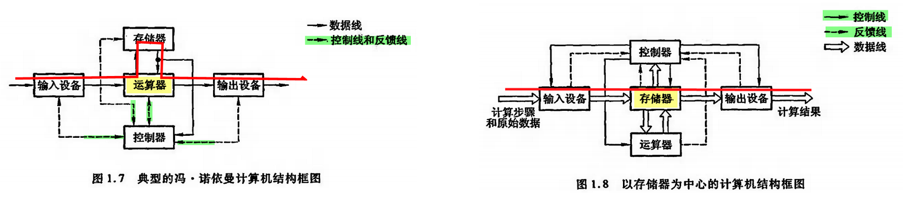

# 前言：计算机组成原理

- 生活装机、底层原理

- 计算机硬件及协调工作

- Q：信息如何用二进制表示？(数字、文本、图像、音频、视频)

- Q：二进制数据如何存储？
- Q：cpu如何取出二进制数据、如何处理二进制数据？

- CS理论基础：计算机组成原理、数据结构与算法、操作系统、计算机网络
- 应试考试408：45 + 45 + 35 + 25

## 计算机系统的组成

- **软件**：系统软件、应用软件

  系统软件：管理整个计算机系统 (操作系统、数据库管理系统、网络系统、标准程序库、语言处理程序、服务程序)

  应用软件：实现用户应用 (科学计算、数据处理、过程控制、事务管理)

- **硬件：主机、外设**

  (CPU、内存、显卡、硬盘、主板、电源、键鼠)

## 计算机的发展 (历史)

图灵：理想计算机

冯诺依曼：ENIAC、EDVAC (弹道计算)

香农：布尔代数、信息论

电子管、晶体管、集成电路、超大规模集成电路

机器语言、汇编语言、高级语言、面向对象

无操作系统、单道批处理系统、多道批处理系统分时系统、现代操作系统

## 从冯诺依曼到现代计算机结构 (BigPicture)

- 计算机的核心问题：**信息的存储、计算、传输**

- 冯诺依曼：**存储程序**

  运算器、存储器、控制器、输入设备、输出设备

  - 指令和数据以二进制存储在存储器中、指令包括操作码和地址码

  - 核心是运算器、弊端是每次IO都有运算器参与

- 现代计算机：

  [(中央处理器、存储器) 主机]、[(IO) 外设] 

  - 核心是存储器、让IO设备与存储器直接交换数据
  - 运算器和控制器在逻辑关系和电路结构上十分紧密 —— 中央处理器CPU

- 计算机五大部件：

  1. 输入设备：人熟悉的信息 -> 计算机能识别的信息

  2. 输出设备：计算机熟悉的信息 -> 人能够识别的信息

  3. 存储器：主存储器、辅助存储器

  - 主存/内存：存放程序和数据、直接与cpu交换信息
  - 辅存/外存：帮主存存储更多信息、必须调入主存后才能被cpu访问 

  4. 运算器：核心是算术逻辑单元ALU

  - ALU：算术(加减乘除)、逻辑(与或非异或移位)
  - 相关寄存器

  5. 控制器：核心是控制单元CU

  - CU：解释存储器中的指令、发出各种操作命令
  - 相关寄存器

## 信息的转换

