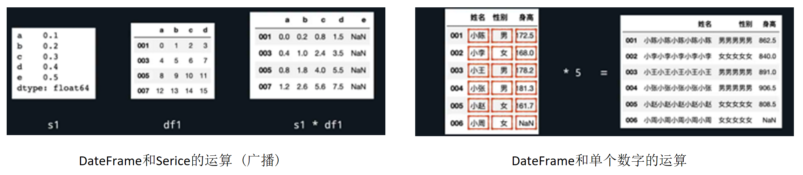
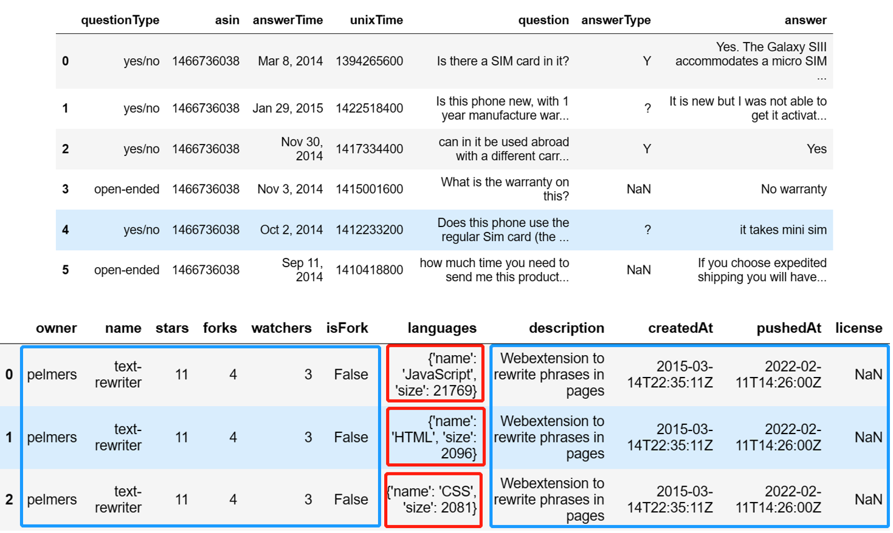
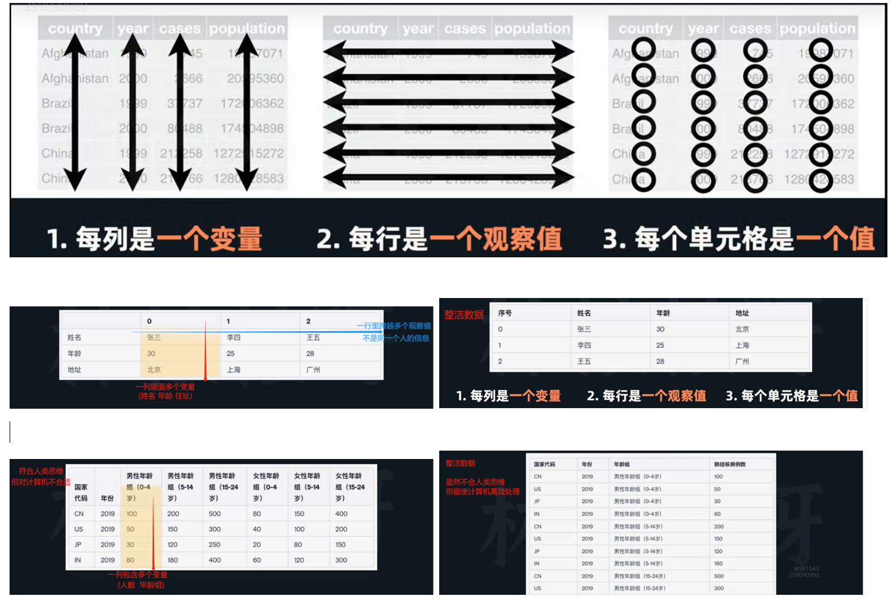
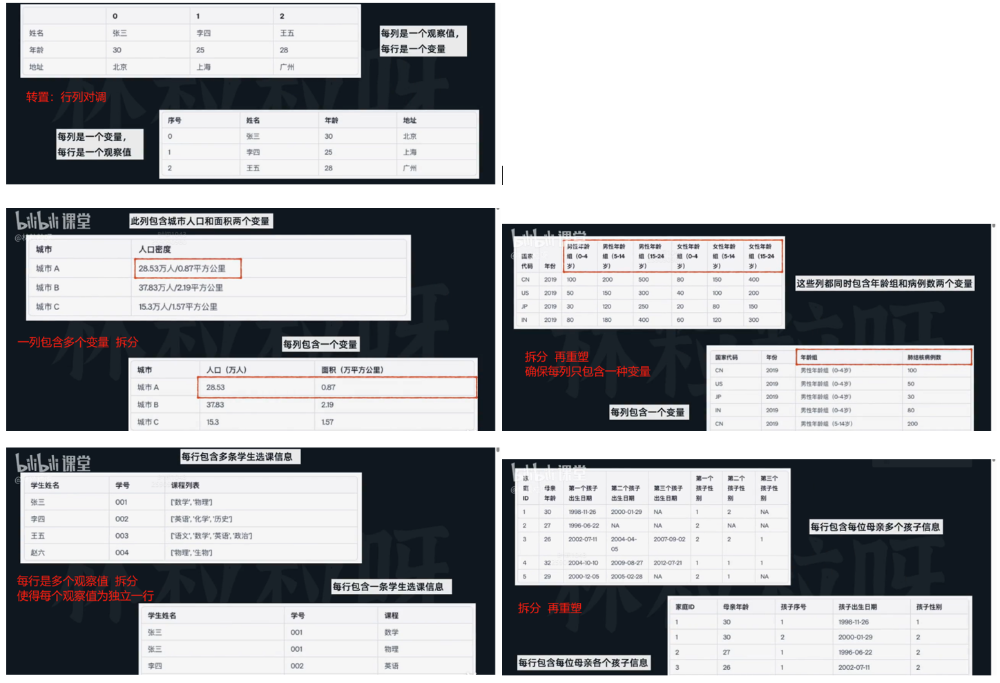
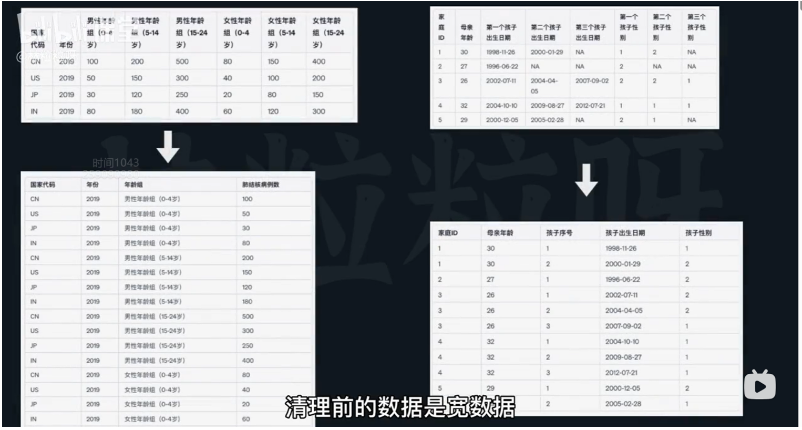

# data-analysis

- Reference - course

  [Python OOP](https://www.bilibili.com/video/BV1qm4y1L7y1/), [Python Pandas](https://www.bilibili.com/video/BV19m4y1L7Yh/), [Matplotlib](https://www.bilibili.com/video/BV11u411V7bL/), 

- 介绍

  小数据分析


# 小数据分析

- 技术栈

  numpy：数学计算

  pandas：数据分析

  matplotlib：画图

  seaborn：再封装的画图

  sklearn：机器学习


- 参考

  [linlili扩展资料 (凝练重点 内容较少)](https://n6fo0mbcz6.feishu.cn/drive/folder/Lm0Xfcbmylxk5CdCNHackWTznLg)


- 环境

  ```
  conda create -n da python==3.8
  conda activate da 
  
  # -i https://pypi.tuna.tsinghua.edu.cn/simple
  pip install numpy pandas matplotlib seaborn scikit-learn
  pip install openpyxl pymysql sqlalchemy 
  ```

  


## numpy

- numpy类库

  比原生python：运行效率高

- 比较

  |      | list (python内置)                                    | ndarray (numpy)                                              | Series (Pandas) | DataFrame (Pandas) |
  | ---- | ---------------------------------------------------- | ------------------------------------------------------------ | --------------- | ------------------ |
  | 特性 | 1 数据类型需要统一 <br/>2 大规模运算的执行速度是乌龟 | 1 数据类型不需统一，最好同类型 <br/>2 大规模运算的执行速度是兔子 (高效) <br/>3 提供了很多作运算的函数 (便利) |                 |                    |

  基础操作

  通过**索引**获得某个元素

  通过**切片**获得某范围的多个元素

  通过循环**迭代**各个元素


### ndarray

- numpy核心数据结构：ndarray

- 创建ndarray

  创建数组：`np.array([[1, 2, 3], [4, 5, 6]])`    // 把列表转换成数组 嵌套列表 -> 二维数组

  创建全零：`np.zeros(3)`                    // 长度为3的 全部元素为0的数组 浮点数

  创建全一：`np.ones(5)`                    // 长度为5的 全部元素为1的数组 浮点数

  创建数列：`np.arange(5, 10, 2)`             // 起始值5  结束值10 步长2 包前不包后

- 根据属性获取

  数组的维度：`arr1.ndim`

  数组的行列：`arr1.shape`                  // 各个维度元素的个数

  数组里元素总个数：`arr1.size`

  数组里元素的类型：`arr1.dtype`           // int64 64位(比特)整数

  ```python
  import numpy as np
  
  # 创建一个变量名为arr1的一维数组，里面的元素为整数6、2、-7、2、8、-2、1
  arr1 = np.array([6, 2, -7, 2, 8, -2, 1])
  # 创建一个变量名为arr2的二维数组，里面的元素为以下两个数组：由整数1、3、5组成的一维数组，以及由整数2、4、6组成的一维数组
  arr2 = np.array([[1, 3, 5], [2, 4, 6]])
  # 分别打印arr1和arr2的维度、形状、元素数量、元素类型
  print(f"arr1的维度：{arr1.ndim}; arr2的维度：{arr2.ndim}")
  print(f"arr1的形状：{arr1.shape}; arr2的形状：{arr2.shape}")  # 元组 由外到里[]
  print(f"arr1的元素数量：{arr1.size}; arr2的元素数量：{arr2.size}")  # 逗号
  print(f"arr1的元素类型：{arr1.dtype}; arr2的元素类型：{arr2.dtype}")
  
  # 创建一个变量名为arr_all_0的一维数组，里面的元素为6个0
  arr_all_0 = np.zeros(6)
  # 创建一个变量名为arr_all_1的一维数组，里面的元素为6个1
  arr_all_1 = np.ones(6)
  # 创建一个变量名为arr_even的一维数组，里面的元素为10（包括10）到20（包括20）之间的偶数
  arr_even = np.arange(10, 21, 2)
  print(arr_even)
  
  ```

  

- 对一维数组的常见操作

  添加：`np.concatenate([arr1, arr2, arr3])`        // 拼接 接收参数是列表 

  排序：`np.sort(arr1)`、`arr1.sort()`               // sort函数 sort方法

  用索引获得元素：`arr1[-1]`                     // 可倒着数

  用切片获得元素：`arr1[1:4]`                    // 索引 包前不包后

- 数组的运算

  数组和数组的运算：加减乘除                 // 要求长度一样相同位置元素加减乘除 对列表需要for循环*2

  数组和数字的运算：广播机制                 // 向量和标量的运算 列表直接挂掉

- 数组的聚合运算                              // 聚合 通过一组值得到一个值

  `arr1.max()`、`arr1.min()`、`arr1.sum()`、`arr1.mean()`

-  通过特定条件从数组中筛选值

  `arr1[arr1 > 5]`                                 // arr1 > 5广播 → bool数组(作为索引)

  结合逻辑运算：`&`、`|`、`~`                      // 区别and &
  
  ```python
  import numpy as np
  
  # 创建arr1为包含了元素1、3、2、4、9的数组，创建arr2为长度为5的由1组成的一维数组，arr3为长度为3的由0组成的一维数组
  arr1 = np.array([1, 3, 2, 4, 9])
  arr2 = np.ones(5)
  arr3 = np.zeros(3)
  
  # 创建数组arr4，包括所有arr1、arr2、arr3里面的数字，并输出
  arr4 = np.concatenate([arr1, arr2, arr3])
  print(arr4)
  
  # 更改arr1，对arr1里的元素进行排序，并输出排序后的结果
  arr1.sort()  # 没有返回值
  print(arr1)
  
  print(arr1[2])  # 用两种方法打印arr1的第三个元素
  print(arr1[-3])  # 倒数索引
  print(arr1[1:4])  # 输出从arr1第2个元素到第4个元素组成的的数组  索引1:3  包前不包后1:4
  print(arr1 + arr2)  # 输出arr1与arr2的同位置元素相加后组成的数组
  print(-5 * arr1)  # 输出arr1的各个元素乘以-5后组成的数组
  
  # 打印arr1数组的最大值、最小值、和、平均值
  print(f"最大值为{arr1.max()}, 最小值为{arr1.min()}, 求和结果为{arr1.sum()}, 平均值为{arr1.mean()}")
  
  # 筛选出arr1数组里所有小于1或大于3的数字，并打印出来
  print(arr1[(arr1 < 1) | (arr1 > 3)])
  
  ```
  
  


## pandas

- [pandas类库](https://pandas.pydata.org/)、[pandas documentation](https://pandas.pydata.org/docs/)

  比原生python：运行效率高、易用数据结构和API、生态
  
  [pandas官方文档](https://pandas.pydata.org/docs/reference/)、[所有Serues方法相关文档](https://pandas.pydata.org/docs/reference/api/pandas.Series.html)、[所有DataFrame方法相关文档](https://pandas.pydata.org/docs/reference/api/pandas.DataFrame.html)


### Series

- pandas核心数据结构：Series

- 创建Series

  创建Series：`pd.Series([1, 2, 3])`            // 传入列表 Series类的构造函数 展示元素和索引

  创建Series且指定索引：`pd.Series([1, 2, 3], index=["青菜", "萝卜", "猪肉"])`

  创建Series的另一种方式：`pd.Series({"青菜":1, "萝卜":2, "猪肉":3})`       // 传入字典 字典的键即索引

- 根据属性获取

  获得Series的元素：`s1.values`

  获得Series的索引：`s1.index`

- 通过特定条件从Series中筛选值

  `s1[s1>1]`                                  // s1 > 1 → bool数组(作为索引)

  结合逻辑运算：`&`、`|`、`~`                 // 区别and &


- 位置索引和标签索引

  用默认索引(位置索引)

  索引操作：`s1[-1]`                         // 单个索引

  切片操作：`s1[1:2]`                         // 包前不包后

  用指定索引(标签索引)  // 也可以指定数字作为标签索引 但挺有病的

  索引操作：`s1["青菜", "猪肉"]`            // 可获取任意多个元素

  切片操作：`s1["青菜":"猪肉"]`             // 标签索引包含结束值

- 一些操作  //  索引取值按标签 切片取值按位置

  用标签索引去索引或切片：`loc`

  用位置索引去索引或切片：`iloc`

  某标签是否存在：`"猪肉" in s1`            // 返回bool

  修改某标签的值：`s1.loc["猪肉"] = 20`     // 根据索引取 赋值覆盖

  ```python
  import pandas as pd
  
  # 创建一个叫s1的Series，里面包含元素-1.2、3.7、2.5、-8.2、6.3。创建后进行输出
  s1 = pd.Series([-1.2, 3.7, 2.5, -8.2, 6.3])
  print(s1)
  print(s1.index)  # 打印s1的所有索引
  print(s1.values)  # 打印s1的所有元素值
  
  # 创建一个叫s2的Series，里面包含元素1、2、3、4、5，并且对应索引5、4、3、2、1。创建后进行输出
  s2 = pd.Series([1, 2, 3, 4, 5], index=[5, 4, 3, 2, 1])
  print(s2)
  print(s2.iloc[1])  # 输出s2里按位置顺序排在第2个的元素
  print(s2.loc[5:3])  # 输出s2里按标签对应从5到3（包括3）范围内的元素
  
  # 通过一个字典来创建Series s3。字典的键为：小李、小陈、小张、小曾、小邓，值为82、93、91、78、68
  s3 = pd.Series({"小李": 82, "小陈": 93, "小张": 91, "小曾": 78, "小邓": 68})
  print(s3)
  
  # 把s3里小张标签对应的值改为95，再输出s3
  s3.loc["小张"] = 95
  print(s3)
  
  # 输出s3里所有值大于80且小于90的元素
  print(s3 > 80)
  print(s3[(s3 > 80) & (s3 < 90)])
  
  ```

  

- Series常见操作

- Series和Series的加减乘除 

  符号运算：`+`、`-`、`*`、`/`               // pd会自动根据索引去对齐 NaN无法得到计算值

  方法运算：`s1.add(s2, fill_value=0)`    // 给缺失值一个默认值 sub() mul() div()

- 常见的统计学方法

  `s1.max()`、`s1.min()`、`s1.sum()`、`s1.mean()`

  `s1.describe()`              // 统计信息：元素个数 平均值 标准差 第一四分位数 中位数 第三四分位数

- 对元素分别操作

  单个数字和Series运算：广播机制

  对Series元素函数操作：`grades = scores.apply(get_grade_from_score)`     // 接收函数作为参数 返回新Series

  也可使用匿名函数(简单逻辑)：`squared_scores = scores.apply(lambda x: x*x)`

  ```python
  import pandas as pd
  
  # 创建Series(可用字典)
  # s1 = pd.Series([92, 67, 70, 88, 76], index=["小明", "小红", "小杰", "小丽", "小华"])
  s1 = pd.Series({"小明": 92, "小红": 67, "小杰": 70, "小丽": 88, "小华": 76})
  s2 = pd.Series({"小明": 95, "小杰": 85, "小宇": 60, "小娟": 79, "小彤": 76})
  print(s1)
  print(s2)
  
  # 根据索引自动对齐，缺失的值为0
  s3 = s1.add(s2, fill_value=0)
  print(s3)
  
  # 常见的统计学方法max min sum mean平均值 std标准差 25%第一四分位数 50%中位数 75%第三四分位数
  print(s1.std())
  print(s1.describe())  # 很多统计信息
  
  # 单个数字，广播机制
  s1 = s1 + 5
  print(s1)
  
  
  # 分数 → 函数 → 等级
  def get_grade_from_score(score):
      if score >= 90:
          return "A"
      elif score >= 80:
          return "B"
      elif score >= 70:
          return "C"
      elif score >= 60:
          return "D"
      else:
          return "不及格"
  
  
  # Series的apply方法(高阶函数)，接收函数作为参数
  s1_grade = s1.apply(get_grade_from_score)
  print(s1_grade)
  
  ```

  

### DataFrame

- pandas核心数据结构：DataFrame

- 创建DataFrame

  字典形式创建DateFrame：`pd.DateFrame({"学号": s_id, "班级": s_class, "成绩": s_grade})`  // s_id等为Series或列表

  一次性创建DateFrame：   // 嵌套字典

  ```python
  df3 = pd.DataFrame({"学号": {"小明": "01", "小红": "02", "小杰": "03", "小丽": "04", "小华": "05"},
             "班级": {"小明": "二班", "小红": "一班", "小杰": "二班", "小丽": "三班", "小华": "一班"},
             "成绩": {"小明": 92, "小红": 67, "小杰": 70, "小丽": 88, "小华": 76}}).T
  ```

- 根据属性获取

  获取DateFrame的索引：`df1.index`

  获取DateFrame的列名：`df1.columns`

  获取DateFrame的所有值：`df1.values`              // 返回np数组

  DateFrame行列转置：`df.T`

- 提取列用列名

  提取DateFrame的指定列：`df1["班级", "成绩"]`     // 返回Series 索引对应索引；多个Series=DateFrame

  提取DateFrame的指定列：`df1.班级`               // 每列视为属性 只能简单的

- 提取行用索引loc iloc

  提取DateFrame的指定行：`df1.loc["小明"]`         // 返回Series 标签对应列名

  提取DateFrame的部分行：`df1.loc["小明": "小杰"]` // 切片 标签索引包含结束值

  提取DateFrame的任意行：`df1.loc[["小明", "小杰"]]`// 接受参数是列表 不相邻的行

  提取DateFrame的某数据：`df1.loc["小明", "学号"]`                    // 接受参数(行, 列)

  提取DateFrame部分数据：`df1.loc["小明": "小杰", "班级": "成绩"]`    // 接受参数(行切片, 列切片)

  提取DateFrame部分数据：`df1.loc[: , "班级": "成绩"]`                  // 第一个切片覆盖所有

  提取DateFrame部分数据：`df1.loc[["小明", "小杰"], "班级": "成绩"]`   // 不相邻的行或列 传入列表

- 通过条件筛选DateFrame符合条件的行           // 每一行代表一个实例 每一列代表实例的属性

  `df1["成绩"]>80`                                     // 放入针对列的条件 df的列是Series + 条件 → boool

  结合逻辑运算：`&`、`|`、`~`                           // 区别and &

- 查看

  返回DateFrame的前五行内容：`df1.head()`         // 传参2指定行数 实际数据集w

  ```python
  import pandas as pd
  
  # 创建Series
  s_name = pd.Series({"001": "小陈", "002": "小李", "003": "小王", "004": "小张", "005": "小赵", "006": "小周", })
  s_gender = pd.Series(["女", "女", "男", "男", "女", "男"], index=["006", "005", "004", "003", "002", "001"])  # 根据索引对齐
  s_height = pd.Series([172.5, 168.0, 178.2, 181.3, 161.7], index=["001", "002", "003", "004", "005"])  # 缺失值not a number
  # 创建DataFrame
  df_students_1 = pd.DataFrame([s_name, s_gender, s_height], index=["姓名", "性别", "身高"])
  df_students_2 = pd.DataFrame({"姓名": s_name, "性别": s_gender, "身高": s_height})  # 推荐用字典
  print(df_students_1)
  print(df_students_2)
  
  # 打印所有索引和列名
  print(df_students_2.index)
  print(df_students_2.columns)
  
  # 行列转置
  print(df_students_1.T)
  
  # 输出身高列  属性/索引
  print(df_students_2.身高)  # 属性
  print(df_students_2["身高"])  # 索引 通用
  
  print(df_students_2[["姓名", "身高"]])
  
  # 输出003行  索引
  print(df_students_2.loc["003"])
  
  print(df_students_2.loc["003":"005"])  # 标签索引 包含结束值
  
  # 输出["005", "身高"]元素
  print(df_students_2.loc["005", "身高"])
  
  # 切片
  print(df_students_2.loc["003":"005", ["姓名", "身高"]])  # 切片/到/:  列表/和/[]
  print(df_students_2.loc["003":"005", "姓名":"身高"])
  print(df_students_2.loc["003":"005", :])  # 省略
  
  # 筛选符合条件的行  每行代表一个实例 每列代表实例的属性
  print(df_students_2.身高 > 165)       # 缺失值 False
  print(df_students_2[(df_students_2.身高 > 165) & (df_students_2.性别 == "女")])
  
  # 返回前五行内容 瞧一眼数据的开头
  print(df_students_2.head())
  
  ```

  


- CRUD

- 更新/添加DateFrame的一列值      // 若列名不存在 则给DateFrame增加新一列

  重新赋值：`df1["成绩"] = s1`          // df1有标签索引 s1要与之对应 否则无法对齐产生缺失值

  重新赋值：`df1["成绩"] = l1`           // l1为列表 不需要标签索引 自动按顺序对齐

- 更新DateFrame的一行值loc iloc         

  重新赋值：`df1.loc["004"] = s1`        // s1标签与df1列名对应 否则缺失值

  重新赋值：`df1.loc["004"] = l1`        // l1为列表 不需要标签索引 自动按顺序对齐

- 添加DateFrame的一行值           // 只能用loc iloc报错

  重新赋值：`df1.loc["004"] = s1`

  重新赋值：`df1.loc["004"] = l1`

- 删除DateFrame的行

  删除一行：`df1.drop("004")`           // drop丢掉 传参为某行标签索引

  删除多行：`df1.drop(["004", "007"])`   // 传参为列表 返回值为新的df

- 删除DateFrame的列

  删除一行：`df1.drop("身高", axis=1)`   // 两个传参 列名 轴线axis=0(默认)沿着索引操作 axis=1沿着列名操作

  删除多行：`df1.drop(["身高", "性别"], axis=1)`   // 两个传参 列名列表 axis

  

- 运算

- DateFrame和DateFrame的运算     // 索引和索引 列名和列名对齐 结果会保留所有索引和列名

  符号运算：`+`、`-`、`*`、`/`               // pd会自动根据索引去对齐 NaN无法得到计算值

  方法运算：`df1.add(df2, fill_value=0)`  // 给缺失值一个默认值 sub() mul() div()

- DateFrame和Serice的运算          // s的索引和df的列名对齐

  广播机制：`s1 * df1`                   // 广播 不同维度数据之间的运算机制

- DateFrame和单个数字的运算

  
  
  ```python
  import pandas as pd
  
  # 创建一个student的df  外层键是列名  里面键是索引
  student_data = {"001": {"姓名": "小陈", "考试1": 85, "考试2": 95, "考试3": 92},
                  "002": {"姓名": "小李", "考试1": 91, "考试2": 92, "考试3": 94},
                  "003": {"姓名": "小王", "考试1": 86, "考试2": 81, "考试3": 89},
                  "004": {"姓名": "小张", "考试1": 79, "考试2": 89, "考试3": 95},
                  "005": {"姓名": "小赵", "考试1": 96, "考试2": 91, "考试3": 91},
                  "006": {"姓名": "小周", "考试1": 81, "考试2": 89, "考试3": 92}}
  df_student = pd.DataFrame(student_data).T
  print(df_student)
  
  # 给`students`增加一列`考试4`，数据依次为：`[72, 69, 79, 83, 82, 76]`
  df_student["考试4"] = [72, 69, 79, 83, 82, 76]
  print(df_student)
  
  # 给`students`添加一行，索引为007，数据为：`"小杨", 79, 82, 81, 69`
  df_student.loc["007"] = ["小杨", 79, 82, 81, 69]
  print(df_student)
  
  # 输出`students`删除索引为006、007的结果，但不要改变`students`本身
  print(df_student.drop(["006", "007"]))
  
  # 输出`students`删除列名为"考试2"、"考试4"的结果，但不要改变`students`本身
  print(df_student.drop(["考试2", "考试4"], axis=1))
  
  # 创建bonus的s
  s_bonus = pd.Series({"考试1": 2, "考试2": 3, "考试3": 2, "考试4": 5})
  print(s_bonus + df_student[["考试1", "考试2", "考试3", "考试4"]])
  
  # 更新`students`的`考试4`，让每项数据值增加10，并输出更新后的结果
  df_student["考试4"] += 10  # 广播机制
  print(df_student)
  
  ```
  
  


- 常见的统计学方法    // 默认 轴0 axis=1 轴1

  `df1.max()`、`df1.min()`、`df1.sum()`、`df1.mean()`

  `df1.describe()`             // 统计信息：得到df各列的统计信息 自动忽略非数字列 类型转化

- 自定义函数操作       // 接受参数是函数 可指定axis 返回值是新的df

  运用在每一列或行：`df1.apply(trim_mean)`     

  运用在每一个元素：`df1.applymap(lambda x: x+5)`       

  ```python
  import pandas as pd
  import numpy as np
  
  # 创建一个`students`的DataFrame
  df_students = pd.DataFrame({"001": {"姓名": "小陈", "考试1": 85, "考试2": 95, "考试3": 92},
                              "002": {"姓名": "小李", "考试1": 91, "考试2": 92, "考试3": 94},
                              "003": {"姓名": "小王", "考试1": 86, "考试2": 81, "考试3": 89},
                              "004": {"姓名": "小张", "考试1": 79, "考试2": 89, "考试3": 95},
                              "005": {"姓名": "小赵", "考试1": 96, "考试2": 91, "考试3": 91},
                              "006": {"姓名": "小周", "考试1": 81, "考试2": 89, "考试3": 92}
                              }).T
  print(df_students)
  
  # 创建一个`student_average`的DataFrame，索引为学号，包含姓名列，以及计算出四次考试平均值后的结果列（列名为"平均分"）
  student_average = df_students.loc[:, "考试1":"考试3"].mean(axis=1)  # series
  student_name = df_students["姓名"]  # serice
  df_student_average = pd.DataFrame({"姓名": student_name, "平均分": student_average})  # 两个Serice合成DF 指定列名
  print(df_student_average)
  
  # 输出每次考试第二高的分数组成的Series，可以尝试结合匿名函数
  s_score_second = df_students.loc[:, "考试1":"考试3"].apply(lambda x: np.sort(x)[-2])
  print(s_score_second)
  
  
  # 根据以下规则，输出每个学号对应的四次考试的等级
  def get_grade_from_score(avg_score):
      if avg_score >= 95:
          return "A+"
      elif avg_score >= 90:
          return "A"
      elif avg_score >= 85:
          return "B+"
      elif avg_score >= 80:
          return "C+"
      else:
          return "C"
  
  s_grade_1 = student_average.apply(get_grade_from_score)
  print(s_grade_1)
  s_grade_2 = df_students.loc[:, "考试1":"考试3"].applymap(get_grade_from_score)
  print(s_grade_2)
  
  # 展示`students`每个考试分数数据列的统计信息，包括个数、平均值、标准差、四分位数等
  df_students["考试1"] = df_students["考试1"].astype("int")  # 类型转化
  df_students["考试2"] = df_students["考试2"].astype("int")  # 类型转化
  df_students["考试3"] = df_students["考试3"].astype("int")  # 类型转化
  print(df_students.describe())
  
  ```

  


## 数据分析全流程

- 数据分析全流程

  1 获取数据、2 读取数据

  3 评估数据、4 清洗数据、5 整理数据

  6 分析数据、7 可视化数据


- 获取数据

  获取私密数据：具体情况

  获取公开数据：直接下载、爬虫、API

- 直接下载公开数据集

  [飞桨数据集(百度旗下深度学习平台)](https://aistudio.baidu.com/aistudio/datasetoverview)、[天池(阿里云旗下开发者竞赛平台)](https://tianchi.aliyun.com/dataset)、[和鲸社区(数据科学开源社区)](https://www.heywhale.com/home/dataset)

- 爬虫：获取网页内容、解析网页内容、储存或分析数据

- 应用程序编程接口：定义了两个程序之间的服务合约


- 常见的数据格式 (成功获取数据后，把数据存储为某种格式)

  `.docx`、`.pdf`、`.jpg`、`.mp4`、

  `.json`、`.csv`

  更改后缀不影响实际文件格式                // 里面的内容遵循的格式规则

  操作系统根据后缀匹配打开文件的程序

- json：js对象表示法

  占用体积小、适配性高 (容易转换成程序语言自己的结构)

  语法：json对象 (python字典`{}`)、json数组 (python列表`[]`)

  ```json
  {
      "questionType": "yes/no",
      "asin": "1466736038",
      "answerTime": "Mar 8, 2014",
      "unixTime": 1394265600,
      "question": "Is there a SIM card in it?",
      "answerType": "Y",
      "answer": "The Galaxy SIII accommodates a micro SIM card."
  }
  
  
  [
    {
      "questionType": "yes/no",
      "asin": "1466736038"
    },
    {
      "questionType": "yes/no",
      "asin": "1466736038"
    },
    {
      "questionType": "yes/no"
    }
  ]
  
  ```

  语法：json值的类型

  ```
  1 数字（整数或浮点数）
  2 字符串（使用双引号括起来） 
  3 逻辑值（true或false）       // 本质是js 小写 python中的True
  4 数组（在方括号中） 
  5 对象（在花括号中） 
  6 空值null                      // python中的none
  ```

- csv：逗号分隔值comma-separated values

  非常规整的二维结构


### 读取数据和保存数据

- df查看

  概况：`df.info()`  (类型、索引范围、列的数量、数据类型、占用memory)

  统计：`df2.describe()`

  取样：`df.head(10)`、`df.tail(10)`、`df.sample(10)`  (默认5) (sample 随机取10行)

- pandas读取数据

  `pd.read_json()`：json

  `pd.read_csv()`：csv(逗号分隔)、tsv(tab分隔)、txt(随便)

  `pd.read_excel()`：excel(xls xlsx)

  `pd.read_sql()`：关系型数据库(mysql)、

- pandas保存数据

  `df1.to_csv("cleaned_sales_data.csv", index=False)`    // 覆盖写入 可忽略df索引写入


- json

  ```json
  {
    "owner": "pelmers",
    "name": "text-rewriter",
    "stars": 11,
    "forks": 4,
    "watchers": 3,
    "isFork": false,
    "languages": [
      {
        "name": "JavaScript",
        "size": 21769
      },
      {
        "name": "HTML",
        "size": 2096
      },
      {
        "name": "CSS",
        "size": 2081
      }
    ],
    "description": "Webextension to rewrite phrases in pages",
    "createdAt": "2015-03-14T22:35:11Z",
    "pushedAt": "2022-02-11T14:26:00Z",
    "license": null
  }
  
  ```

  


- csv

  `pd.set_option("display.max_columns", 150)`     // 提高展示列的上限 默认20

  `pd.set_option("display.max_colwidth", 500)`     // 展示值包含的字符 默认50

  `df = pd.read_csv("./amazon.csv", header=None, index_col="plager_id")`   // 默认第一行列名(不) 指定标签索引


### 评估数据

- 数据的问题：不整洁、不干净

  **结构**：乱数据 -> 整洁数据

  **内容**：脏数据 -> 干净数据

- 整洁数据 (埃德加科德 第三范式)

  1 每列是一个变量

  2 每行是一个观察值

  3 每个单元格是一个值

- 脏数据存在的问题

  1 丢失数据NaN

  2 重复数据

  3 不一致数据：数字单位不一致、全称简写混用、中文数字阿拉伯数字混用……

  4 无效或错误数据：脱离现实、虽然符合规整但不准确       // 身高-1.65  体重3.40kg

  


- 结构性问题 (较好评估 更直观易发现)

  概况：`df.info()` 

  取样：`df.head(10)`、`df.tail(10)`、`df.sample(10)`  // 随机取10行

- 例子

  某列名是`销售额_2020` - 两个变量


- 内容性问题

- 评估丢失数据

  `df.info();`                         // 每列非空缺值数量 

  `df.isnull().sum()`                  // 检查值是否空缺 返回bool的df 再求和

  `scores[scores["math"].isnull()]`     // 提取丢失数据的行 条件

- 评估重复数据

  `df.duplicated(subset=["学号","性别"])`      // 检查行或值是否存在重复 返回bool组成的df 指定变量

  `students[students.duplicated(subset=["学号","性别"])]`     // 通过条件提取该重复行

- 评估不一致数据

  `df["班级"].value_counts()`        // 返回Series中各个值的个数 1班(5) 二班(6)

- 评估无效错误数据

  `df["身高"].sort_value()`      // 返回Series中各个值的排序 (-165.1 1.66 1.78 111.0) 发现诡异的值

  `df.describe()`                 // 统计信息


### 清洗数据

- 问题分析

  索引列名：重命名重排序

  结构处理：转置、拆分、重塑

  内容处理：丢失；重复；不一致；无效

  


- 结构问题的处理

  

  


- 内容处理：

  丢失(手动补、不处理、删除整行、填充平均数)； // pd自动忽略空缺值

  重复(删除即可)；

  不一致(替换统一)；

  无效(删除、替换)

- 其他的内容问题

  把手机号当成int           // 求最大值 应转string

  是否参加活动string        // 转化为bool会更方便


- 用pd实现数据清理

  拆分列、重塑行、删除空缺值、删除重复数据、数据类型转换


- 清理列名和索引

- 重命名索引或列名：

  `df.rename(index={…})`       // 老的作为键 新的作为值 不改变原df可赋值

  `df.rename(columns={…})`     // 老的作为键 新的作为值 不改变原df可赋值

  `df.rename(index={…}, inplace=True)`   // 原地修改原始df 没有返回值

  `df.rename(index=某函数某方法)`      // 系统自带：str.upper全部大写

- 把某列设为索引：`df.set_index("列名")`

  重设索引为初始：`df.reset_index()`

- 对索引和列名重新排序：

  `df.sort_index()`     // 默认axis为0 沿着索引纵向操作 axis为1 沿着列名横向操作

  `df.sort_index(, inplace=True)`                    // 此时没返回值


- 清理数据内容(结构性问题)

- 行列倒置           → 行列转置：        

  `df1.T`         // 每列是一个变量 每行是一个观察值

- 多属性构成一列    → 对列进行拆分：   

  单个字符串拆分：     `str1.split("/")`                                   // 23人/0.87km2 → [23, 0.87]

  Series拆分：           `df1["人口密度"].str.split("/", expand=True)`     // 分割后的结果用单独的Serues表示

  // df1[["人口","密度"]] = df1["人口密度"].str.split("/", expand=True)

  并删除拆分前的列：`df1 = df1.drop("人口密度", axis=1)`                

- 把不同的列合并成一列：`df["姓"].str.cat(df3["名"], sep="·")`        // 指定拼接时的分隔符

- 宽数据转化长数据：`pd.melt(df1, id_vars=["国家代码","年份"], var_name="年龄组", value_name="肺结核病例数")`

  // id_vars想保持原样的列 var_name新df列名(原本列名值) value_name新df列名(原本变量值)

  // 把一部分列名的值转化成变量的值

- 拆分行：`df1.explode("课程列表")`

- 清理无效或无用的行或列：`df1.drop(, axis=1, inplace=True)`      // 传参：单个索引、单个列名、列表(多行或多列)

  // 基本df操作不改变原df，指定参数inplace=True则会作用在原df上


- 清理数据内容(内容性问题)

- 对整列缺失数据进行填充：`df1["国家"] = "中国"`

- 对某一缺失数据进行填充：`df1.loc["003","销售额"] = 800`                  // 标签索引 列名

- 对某部分的缺失进行填充：`df1.loc["003":"004","日期"] = "2005-01-03"`     // 切片

- 自动找到缺失值进行填充：

  `df1["B"].fillna(0)、df1["B"].fillna(df["B"].mean())`、

  `df1.fillna(0)`、`df1.fillna({"A":0 ,"B":10 ,"C":20})`

- 抛弃存在空缺值的观察值：

  `df1.dropna(, axis=0)`                            // 返回没有缺失值组成的df 删行

  `df1.dropna(subset=["工资"])`                  // 只删除工资变量缺失的数据

- 删除重复数据：             

  `df1["姓名"].drop_duplicates()`                  // 删除Series重复值

  `df1.drop_duplicates()`                          // 删除df重复值 对象(所有变量)

  `df1.drop_duplicates(keep="last")`               // 默认删除后一个重复

  `df1.drop_duplicates(subset=["姓名","性别"])`   // 当俩姓名性别同时一样 删除

- 不一致数据 → 对值进行替换：  

  `df1["学校"].replace("清华","清华大学")`   // 两个 替换成后者

  `df1.replace(["清华","五道口"],"清华大学")` // 两个 一参可列表

  `df1.replace({……})`

- 数据类型转换：

  `s1.astype("category")`  // 在pd中字符串类型object  类型判断：type(3.0)

  // pd的特有数据类型：`category`分类数据(包含有限数量的不同类别的数据) 性别是有限的只有男女 节约内存

  分类数据：包含有限数量的不同类别的数据)     // 性别是有限的只有男女
  
  数值数据：测量出的观测值                       // 0到1有无数个数字


### 整理数据 (数据的连接合并)

- 数据的连接合并

  对df纵向简单粗暴拼接：`pd.concat([df1,df2], ignore_index=True)`

  对df横向简单粗暴拼接：`pd.concat([df1,df2], axis=1)`       // 沿着列名横向操作

  对df基于匹配进行合并： 

  `pd.marge(df1,df2, on="客户ID")` // 数据库

  `pd.marge(df1,df2, on=["客户ID","订单日期"])`  

  `pd.marge(df1,df2, left_on="客户ID",right_on="客户编号"])`

  


### 分析数据 (ml)


### 可视化数据


## matplotlib seaborn


## Echarts

- Echarts

  百度

  官网：https://pyecharts.org/#/

  画廊：https://gallery.pyecharts.org/#/


- 快速入门

  


## 参考数据集

- [沃尔玛销售数据](https://n6fo0mbcz6.feishu.cn/file/Bud8bGgmIoM8ZMxlyJicYLX7nSg)

  简介：数据集包含沃尔玛的销售数据。沃尔玛全国范围内有多家零售门店在库存管理方面的问题，那么如何将供应与需求相匹配呢？作为一名数据科学家，你可以利用数据，提供有用的见解，并创建预测模型，从而能预测未来X个月/年的销售情况。

- 变量含义：

  Store：店铺编号

  Date：销售周

  Weekly_Sales：店铺在该周的销售额

  Holiday_Flag：是否为假日周

  Temperature：销售日的温度

  Fuel_Price：该地区的燃油成本

  CPI（消费者物价指数）：消费者物价指数

  Unemployment：失业率


# practice

## 303demo2

- 数据处理

  > 根据给出的数据表考生信息（test_ksxx.csv）和考生成绩（test_kscj.csv），完成以下任务：
  >
  > 1 数据处理
  >
  > 1.1 部分的考生信息和考生成绩对不上，如果有考生信息没有考生成绩的，请将该考生成绩全部置零；如果有考生成绩没有考生信息的，请将该考生成绩记录删除。
  >
  > 1.2 部分学校出现在多个县区中，请将学校保留在考生最多的县区中，并将其它县区改为这个县区。
  >
  > 1.3 除语文、数学、英语、体育外，其它科目需要进行折算。物理、化学按0.6折算；政治、历史按0.5折算；生物、地理按0.3折算。折算后计算总分。

- 猜测

  各科满分：语数英 (150, 150, 150)、体育 (70)、物理化学 (100, 100)、历史政治 (100, 100)、生物地理 (100, 100)

  各科折算：语数英 (1, 1, 1)、体育 (1)、物理化学 (0.6, 0.6)、历史政治 (0.5, 0.5)、生物地理 (0.3, 0.3)

  折算后满分：450 + 70 + 60 * 2 + 50 * 2 + 30 * 2 = 800


- 前置

  导库、定义变量

  ```python
  import pandas as pd
  # pip install pandas openpyxl
  
  pd.set_option('display.max_columns', None)
  
  # 折算关系
  subjects_discount = {
      '语文': 1, '数学': 1, '英语': 1, '体育': 1,
      '物理': 0.6, '化学': 0.6,
      '政治': 0.5, '历史': 0.5,
      '生物': 0.3, '地理': 0.3
  }
  subjects = list(subjects_discount.keys())
  
  # 各科满分 (及格是满分的*0.6)
  subjects_full = {
      '语文': 150, '数学': 150, '英语': 150, '体育': 70,
      '物理': 100, '化学': 100,
      '政治': 100, '历史': 100,
      '生物': 100, '地理': 100
  }
  
  ```

  查看数据集

  ```python
  df_info = pd.read_csv("./data/test_ksxx.csv")
  df_score = pd.read_csv("./data/test_kscj.csv")
  # print("df_info:\n", df_info)
  # print("df_score:\n", df_score)
  
  # print(df_info.info(), "\n")  # 43400 rows  43400 not-null
  # print(df_score.info(), "\n")  # 43404 rows  43400 not-null
  # print(df_info.isnull().sum(), "\n")  # 0
  # print(df_score.isnull().sum(), "\n")  # 0
  
  ```

  存在重复的考生号 (认为第二次出现为无效数据)

  ```python
  # 查看df_info中存在重复的考生号 (df_score同理)
  df_info_id_count = df_info['考生号'].value_counts()
  df_info_id_count_dup = df_info_id_count[df_info_id_count > 1]
  df_score_id_count = df_score['考生号'].value_counts()
  df_score_id_count_dup = df_score_id_count[df_score_id_count > 1]
  # print(df_info_id_count_dup, df_score_id_count_dup)  # 5  # 5
  
  # 对于df_info中重复的考生号，保留第一次出现的，删除后面的 (df_score同理)
  df_info = df_info.drop_duplicates(subset='考生号', keep='first')
  df_score = df_score.drop_duplicates(subset='考生号', keep='first')
  # print(df_info)  # 43400 -> 43395
  # print(df_score)  # 43404 -> 43399
  
  ```

  

  


### Q1

- 两张表考生号枚举值

  ```python
  # 列出df_info、df_score中列名为考生号的枚举值
  df_info_id = df_info['考生号'].unique()
  df_score_id = df_score['考生号'].unique()
  
  # 列出df_info有的、df_score没有的考生号；列出df_score有的、df_info没有的考生号
  df_info_id_only = list(set(df_info_id) - set(df_score_id))
  df_score_id_only = list(set(df_score_id) - set(df_info_id))
  # print(df_info_id_only, df_score_id_only)  # []  # [21951722, 63822363, 76290389, 49590743]
  
  ```

  Q1.1：有考生信息没有考生成绩的，请将该考生成绩全部置零

  ```python
  # 不存在这样的信息，不用操作
  ```

  Q1.1：如果有考生成绩没有考生信息的，请将该考生成绩记录删除

  ```python
  # 删除df_score中的df_score_id_only对应的行
  df_score = df_score[~df_score['考生号'].isin(df_score_id_only)]
  # print(df_score)  # 43399 -> 43395
  
  df_score
  ```

  


- 查看字段：县区代码、学校代码

  ```python
  # 查看df_info中，县区代码字段的枚举值；查看df_info中，学校代码字段的枚举值
  df_info_area = df_info['县区代码'].unique()
  df_info_school = df_info['学校代码'].unique()
  print(len(df_info_area), len(df_info_school))  # 15  # 217
  # print(df_info_area, "\n", df_info_school)
  
  # 统计每个学校在每个县区的考生数量
  df_info_group_school_area = df_info.groupby(['学校代码', '县区代码'])['考生号'].count().reset_index(name='考生数量')
  # print(df_info_group_school_area)  # 376
  
  ```

  Q1.2：部分学校出现在多个县区中，请将学校保留在考生最多的县区中，并将其它县区改为这个县区

  ```python
  # 确定每个学校最多的考生所在县区
  max_students_per_school = df_info_group_school_area.loc[
      df_info_group_school_area.groupby('学校代码')['考生数量'].idxmax()]
  # print(max_students_per_school)  # 217
  
  # 创建一个映射，将学校代码映射到最多的考生所在县区代码
  school_to_area_map = max_students_per_school.set_index('学校代码')['县区代码'].to_dict()
  # print(len(school_to_area_map), "\n", school_to_area_map)  # 217
  
  # 使用映射更新df_info
  df_info['县区代码'] = df_info.apply(lambda row: school_to_area_map.get(row['学校代码'], row['县区代码']), axis=1)
  
  # check
  df_info_group_school_area = df_info.groupby(['学校代码', '县区代码'])['考生号'].count().reset_index(name='考生数量')
  # print(df_info_group_school_area)  # 376 -> 217
  
  df_info
  
  ```

  


- Q1.3：折算后计算总分

  ```python
  # 折算分数
  df_q13 = df_score.copy()
  for subject, factor in subjects_discount.items():
      df_q13[subject] = df_score[subject] * factor
  # print(df_q13)
  
  # 将每行的语数英...字段进行累加，得到总分字段
  df_q13['折算总分'] = df_q13.apply(
      lambda row: sum(row[subject] for subject in subjects), axis=1)
  df_score['折算总分'] = df_q13['折算总分'].apply(lambda x: round(x, 2))
  
  df_score
  ```

  


### Q2.2

- 统计数据并保存

  > 2 统计数据并保存
  >
  > 2.1 统计分析的结果保存在文件zlfx.xlsx中。
  >
  > 2.2 统计全市各县区的考生数据，要求字段如下：
  >
  >  - 县区代码
  >
  >  - 考生数：该县区的考生人数。
  >
  >  - 与考数：该县区未缺考的人数。（其中各科成绩都为0分的视为缺考）
  >
  >  - 与考率：与考数除以考生数。（要求以百分比形式，保留两位小数）
  >
  >  - 语数英三科均分率：语文、数学、英语三科累加分除以450（三科满分）。（要求以百分比形式，保留两位小数）
  >
  >  - 十科均分率：十个科目累加分除以800（十科折算后满分）。（要求以百分比形式，保留两位小数）
  >
  >  - 优秀率：总分大于等于640为优秀。
  >
  >  - 单科及格率：各科及格人次除以10倍的考生数。
  >
  >  - 四率综合比：（语数英三科均分率+十科均分率）* 0.3 + （优秀率 + 单科及格率）* 0.2。（要求以百分比形式，保留两位小数）
  >
  >  - 排名：按照四率综合比进行排名。
  >
  >    结果文件保存在文件zlfx.xlsx中的'县区'表中。
  >
  > 2.3 统计各县区下各学校的考生数据，要求字段如下：
  >
  >  - 学校代码
  >
  >  - 考生数：该学校的考生人数。
  >
  >  - 与考数：该学校未缺考的人数。（其中各科成绩都为0分的视为缺考）
  >
  >  - 与考率：与考数除以考生数。（要求以百分比形式，保留两位小数）
  >
  >  - 语数英三科均分率：语文、数学、英语三科累加分除以450（三科满分）。（要求以百分比形式，保留两位小数）
  >
  >  - 十科均分率：十个科目累加分除以800（十科折算后满分）。（要求以百分比形式，保留两位小数）
  >
  >  - 优秀率：总分大于等于640为优秀。
  >
  >  - 单科及格率：各科及格人次除以10倍的考生数。
  >
  >  - 四率综合比：（语数英三科均分率+十科均分率）* 0.3 + （优秀率 + 单科及格率）* 0.2。（要求以百分比形式，保留两位小数）
  >
  >  - 排名：按照四率综合比进行排名。
  >
  >    结果文件保存在文件zlfx.xlsx中按县区代码命名的表中。

  


- Q2公共模块

  合并两张表

  ```python
  df_merge_info_score = pd.merge(df_info, df_score, on='考生号')
  # print(len(df_info), len(df_score), len(df_merge_info_score))  # 43395  # 43395  # 43395
  
  # 以csv形式输出中间结果
  df_info.to_csv("./tmp/df_info.csv", index=False)
  df_score.to_csv("./tmp/df_score.csv", index=False)
  df_merge_info_score.to_csv("./tmp/df_merge_info_score.csv", index=False)
  
  
  # 在df_merge_info_score，当subjects字段都为0时，认为是缺考，其缺考字段设置为1，否则设置为0
  df_merge_info_score['缺考'] = df_merge_info_score.apply(
      lambda row: 1 if sum(row[subject] for subject in subjects) == 0 else 0, axis=1)
  df_merge_info_score.to_csv("./tmp/df_merge_info_score.csv", index=False)
  
  # check 查看缺考
  df_q22_missing = df_merge_info_score[df_merge_info_score['缺考'] == 1]
  # print(df_q22_missing)  # 609
  
  ```

  每个考生的语数英三科均分率、十科均分率

  ```python
  # 计算每个考生的语数英总分、所有科目成绩累加
  df_merge_info_score['语数英总分'] = df_merge_info_score[subjects[:3]].sum(axis=1)
  # 计算每个考生的语数英均分率(450；要求以百分比形式，保留两位小数)
  df_merge_info_score['语数英三科均分率(%)'] = df_merge_info_score.apply(
      lambda row: round(row['语数英总分'] / 450 * 100, 2), axis=1)
  # 计算每个考生的所有科目均分率(800；要求以百分比形式，保留两位小数)
  df_merge_info_score['十科均分率(%)'] = df_merge_info_score.apply(
      lambda row: round(row['折算总分'] / 800 * 100, 2), axis=1)
  df_merge_info_score.to_csv("./tmp/df_merge_info_score.csv", index=False)
  
  ```

  每个考生的优秀情况

  ```python
  # 在df_merge_info_score，判断考生是否优秀(折算总分字段>=640)，优秀为1，否则为0
  df_merge_info_score['是否优秀'] = df_merge_info_score.apply(lambda row: 1 if row['折算总分'] >= 640 else 0, axis=1)
  df_merge_info_score.to_csv("./tmp/df_merge_info_score.csv", index=False)
  
  ```

  每个考生的及格情况

  ```python
  # 在df_merge_info_score，分别在各个科目中，判断考生是否及格，及格为1，否则为0
  for subject, full in subjects_full.items():
      df_merge_info_score[subject + '是否及格'] = df_merge_info_score.apply(
          lambda row: 1 if row[subject] >= full * 0.6 else 0, axis=1)
  
  # df_merge_info_score，对[subject + '是否及格']的各个字段求和，得到一个考生的及格次数
  df_merge_info_score['单科及格次数'] = df_merge_info_score[
      list(subject + '是否及格' for subject in subjects_full.keys())].sum(axis=1)
  df_merge_info_score.to_csv("./tmp/df_merge_info_score.csv", index=False)
  
  df_merge_info_score
  ```

  


- Q2.2：统计全市各县区的考生数据

  每个县区的考生数、与考数、与考率

  ```python
  # 对于每个县区，计算考生数
  df_q22_1 = df_merge_info_score['县区代码'].value_counts().reset_index()
  df_q22_1.columns = ['县区代码', '考生数']
  # 对于每个县区，计算非缺考人数
  every_area_missing = df_merge_info_score.groupby('县区代码')['缺考'].sum().reset_index()
  every_area_missing.columns = ['县区代码', '缺考人数']
  # print(df_q22_1, "\n", every_area_missing)
  
  # 对于每个县区，与考数 = 考生数 - 缺考人数
  df_q22 = pd.merge(df_q22_1, every_area_missing, on='县区代码', how='left')
  df_q22['与考数'] = df_q22['考生数'] - df_q22['缺考人数']
  # 对于每个学校，计算与考率 (与考数除以考生数，要求以百分比形式，保留两位小数)
  df_q22["与考率(%)"] = df_q22.apply(lambda row: round(row['与考数'] / row['考生数'] * 100, 2), axis=1)
  df_q22.to_csv("./tmp/df_q22.csv", index=False)
  
  ```

  每个县区的语数英均分率、十科均分率 (方法2)

  错误原因是没有用到第一题的条件 (还有应该考虑的是与考数，不是考生数)

  ```python
  # 计算每个县区的语数英均分率、所有科目均分率
  df_q22_2 = df_merge_info_score.groupby('县区代码')['语数英三科均分率(%)'].mean().reset_index(name='语数英三科均分率(%)')
  df_q22_3 = df_merge_info_score.groupby('县区代码')['十科均分率(%)'].mean().reset_index(name='十科均分率(%)')
  # 保留两位小数
  df_q22_2['语数英三科均分率(%)'] = df_q22_2['语数英三科均分率(%)'].apply(lambda x: round(x, 2))
  df_q22_3['十科均分率(%)'] = df_q22_3['十科均分率(%)'].apply(lambda x: round(x, 2))
  # print(df_q22_2，"\n", df_q22_3)
  
  df_q22 = pd.merge(df_q22, df_q22_2, on='县区代码', how='left')
  df_q22 = pd.merge(df_q22, df_q22_3, on='县区代码', how='left')
  df_q22.to_csv("./tmp/df_q22.csv", index=False)
  
  ```

  每个县区的优秀率、单科及格率

  ```python
  # 计算每个县区的优秀率
  df_q22_4 = df_merge_info_score.groupby('县区代码')['是否优秀'].mean().reset_index(name='优秀率(%)')
  df_q22_4['优秀率(%)'] = df_q22_4['优秀率(%)'].apply(lambda x: round(x * 100, 2))
  # print(df_q22_4)
  df_q22 = pd.merge(df_q22, df_q22_4, on='县区代码', how='left')
  df_q22.to_csv("./tmp/df_q22.csv", index=False)
  
  # 计算每个县区的及格人次
  df_q22_5 = df_merge_info_score.groupby('县区代码')['单科及格次数'].sum().reset_index(name='单科及格人次')
  # print(df_q22_5)
  df_q22 = pd.merge(df_q22, df_q22_5, on='县区代码', how='left')
  # 计算每个县区的及格率 (及格人次除以考生数*10，要求以百分比形式，保留两位小数)
  df_q22['单科及格率(%)'] = df_q22.apply(lambda row: round(row['单科及格人次'] / (row['与考数'] * 10) * 100, 2), axis=1)
  df_q22.to_csv("./tmp/df_q22.csv", index=False)
  
  ```

  每个县区的四率综合比、排名

  ```python
  # 对df_q22，四率综合比：（语数英三科均分率+十科均分率）* 0.3 + （优秀率 + 单科及格率）* 0.2。（要求以百分比形式，保留两位小数）
  df_q22['四率综合比(%)'] = df_q22.apply(
      lambda row: round(
          (row['语数英三科均分率(%)'] + row['十科均分率(%)']) * 0.3 + (row['优秀率(%)'] + row['单科及格率(%)']) * 0.2, 2),
      axis=1)
  # 对df_q22，按综合四率排序
  df_q22['排名'] = df_q22['四率综合比(%)'].rank(ascending=False).astype(int)
  df_q22 = df_q22.sort_values(by='四率综合比(%)', ascending=False)
  df_q22.to_csv("./tmp/df_q22.csv", index=False)
  
  ```

  输出结果

  ```python
  # 整理列
  df_q22 = df_q22.drop(columns=['缺考人数', '单科及格人次'])
  df_q22.to_csv("./tmp/df_q22.csv", index=False)
  
  df_q22
  ```

  


### Q2.3

- Q2.3

  每个学校的考生数、与考数、与考率

  ```python
  # 对于每个学校，计算考生数
  df_q23_1 = df_merge_info_score['学校代码'].value_counts().reset_index()
  df_q23_1.columns = ['学校代码', '考生数']
  # 对于每个学校，计算非缺考人数
  every_school_missing = df_merge_info_score.groupby('学校代码')['缺考'].sum().reset_index()
  every_school_missing.columns = ['学校代码', '缺考人数']
  # print(df_q23_1, every_school_missing)
  
  # 对于每个学校，与考数 = 考生数 - 缺考人数
  df_q23 = pd.merge(df_q23_1, every_school_missing, on='学校代码', how='left')
  df_q23['与考数'] = df_q23['考生数'] - df_q23['缺考人数']
  # 对于每个学校，计算与考率 (与考数除以考生数，要求以百分比形式，保留两位小数)
  df_q23["与考率(%)"] = df_q23.apply(lambda row: round(row['与考数'] / row['考生数'] * 100, 2), axis=1)
  df_q23.to_csv("./tmp/df_q23.csv", index=False)
  
  ```

  每个学校的语数英三科均分率、十科均分率

  ```python
  # 计算每个学校的语数英均分率、所有科目均分率
  df_q23_2 = df_merge_info_score.groupby('学校代码')['语数英三科均分率(%)'].mean().reset_index(name='语数英三科均分率(%)')
  df_q23_3 = df_merge_info_score.groupby('学校代码')['十科均分率(%)'].mean().reset_index(name='十科均分率(%)')
  # 保留两位小数
  df_q23_2['语数英三科均分率(%)'] = df_q23_2['语数英三科均分率(%)'].apply(lambda x: round(x, 2))
  df_q23_3['十科均分率(%)'] = df_q23_3['十科均分率(%)'].apply(lambda x: round(x, 2))
  # print(df_q23_2, df_q23_3)
  
  df_q23 = pd.merge(df_q23, df_q23_2, on='学校代码', how='left')
  df_q23 = pd.merge(df_q23, df_q23_3, on='学校代码', how='left')
  df_q22.to_csv("./tmp/df_q23.csv", index=False)
  
  ```

  每个学校的优秀率、单科及格率

  ```python
  # 计算每个学校的优秀率
  df_q23_4 = df_merge_info_score.groupby('学校代码')['是否优秀'].mean().reset_index(name='优秀率(%)')
  df_q23_4['优秀率(%)'] = df_q23_4['优秀率(%)'].apply(lambda x: round(x * 100, 2))
  # print(df_q23_4)
  df_q23 = pd.merge(df_q23, df_q23_4, on='学校代码', how='left')
  df_q23.to_csv("./tmp/df_q23.csv", index=False)
  
  # 计算每个学校的及格人次
  df_q23_5 = df_merge_info_score.groupby('学校代码')['单科及格次数'].sum().reset_index(name='单科及格人次')
  # print(df_q22_5)
  df_q23 = pd.merge(df_q23, df_q23_5, on='学校代码', how='left')
  # 计算每个学校的及格率 (及格人次除以考生数*10，要求以百分比形式，保留两位小数)
  df_q23['单科及格率(%)'] = df_q23.apply(lambda row: round(row['单科及格人次'] / (row['与考数'] * 10) * 100, 2), axis=1)
  df_q23.to_csv("./tmp/df_q23.csv", index=False)
  
  ```

  每个学校的四率综合比、排名

  ```python
  # 对df_q23，四率综合比：（语数英三科均分率+十科均分率）* 0.3 + （优秀率 + 单科及格率）* 0.2。（要求以百分比形式，保留两位小数）
  df_q23['四率综合比(%)'] = df_q23.apply(
      lambda row: round(
          (row['语数英三科均分率(%)'] + row['十科均分率(%)']) * 0.3 + (row['优秀率(%)'] + row['单科及格率(%)']) * 0.2, 2),
      axis=1)
  # 对df_q23，按综合四率排序
  df_q23['排名'] = df_q23['四率综合比(%)'].rank(ascending=False).astype(int)
  df_q23 = df_q23.sort_values(by='四率综合比(%)', ascending=False)
  df_q23.to_csv("./tmp/df_q23.csv", index=False)
  
  ```

  输出结果

  ```python
  # 创建县区代码和学校代码的映射关系
  df_q23_6 = df_info[["县区代码", "学校代码"]]
  map_for_area = {}
  for index, row in df_q23_6.iterrows():
      map_for_area[row["学校代码"]] = row["县区代码"]
  
  # 县区代码的枚举值
  area_enum = df_q23_6["县区代码"].unique()
  print(area_enum)
  
  # 将map_for_area转为df
  df_map_for_area = pd.DataFrame(map_for_area.items(), columns=["学校代码", "县区代码"])
  # print(df_map_for_area)
  
  # 整理列
  df_q23 = df_q23.drop(columns=['缺考人数', '单科及格人次'])
  # df_q23左连接df_info，得到每个学校的县区代码
  df_q23 = pd.merge(df_q23, df_map_for_area, on='学校代码', how='left')
  df_q23.to_csv("./tmp/df_q23.csv", index=False)
  
  # df_23按照县区代码字段进行分组，分别存储到许多个df中
  df_q23_result = {}
  for area in area_enum:
      df_q23_result[area] = df_q23[df_q23["县区代码"] == area]
  
  # 将最后一系列df_result分别保存到多个csv中
  for area in area_enum:
      df_q23_result[area].to_csv("./tmp/df_q23_result_" + str(area) + ".csv", index=False)
      
  ```

  保存在excel

  ```python
  df_q22.to_excel('zlfx.xlsx', sheet_name='县区', index=False)
  with pd.ExcelWriter('zlfx.xlsx', mode='a', if_sheet_exists='overlay') as writer:
      for area, df in df_q23_result.items():
          df.to_excel(writer, sheet_name=str(area), index=False)
  ```

  


